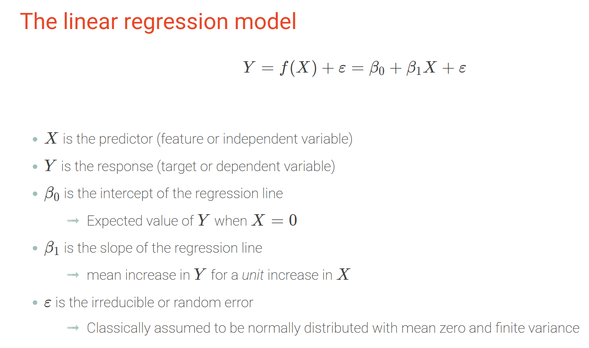
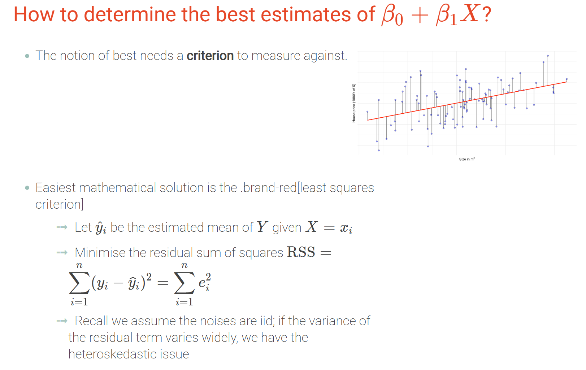
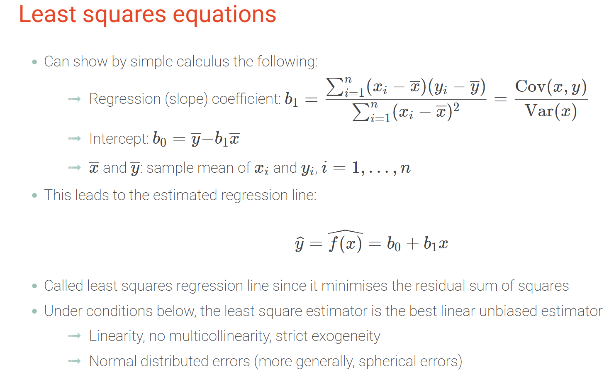
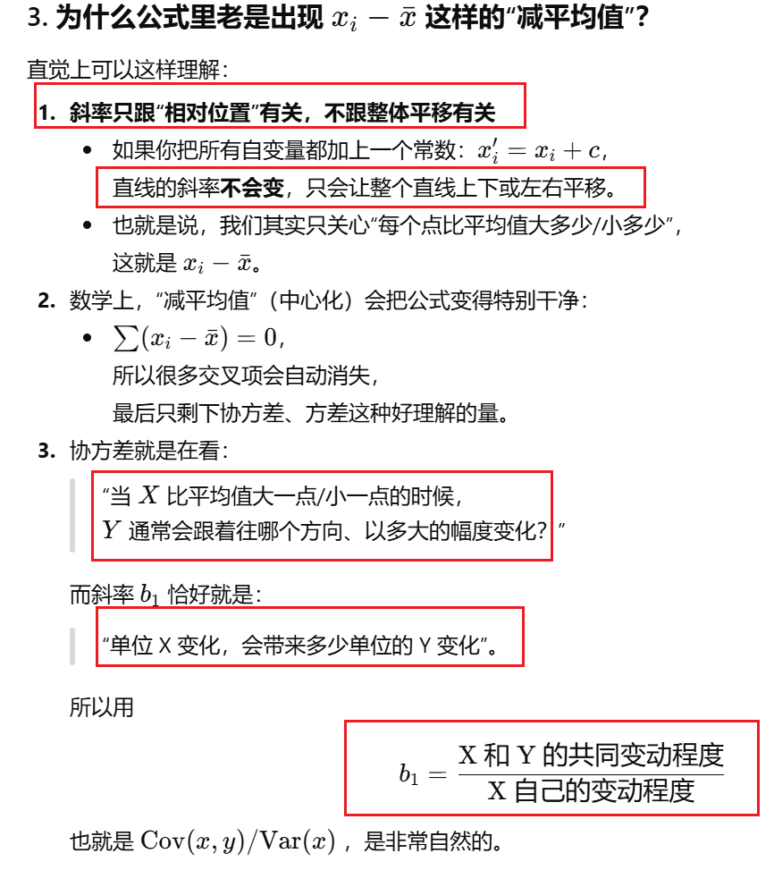
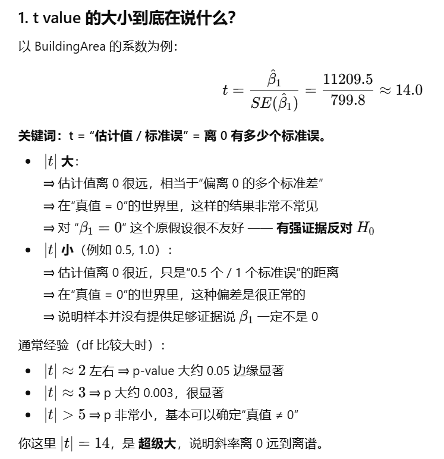
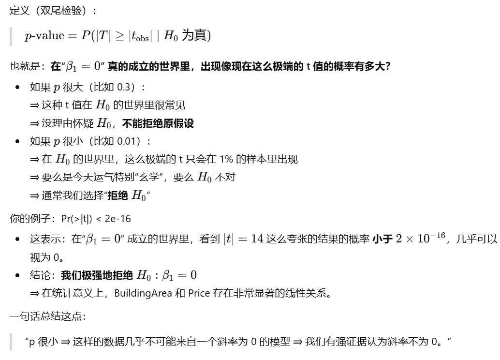
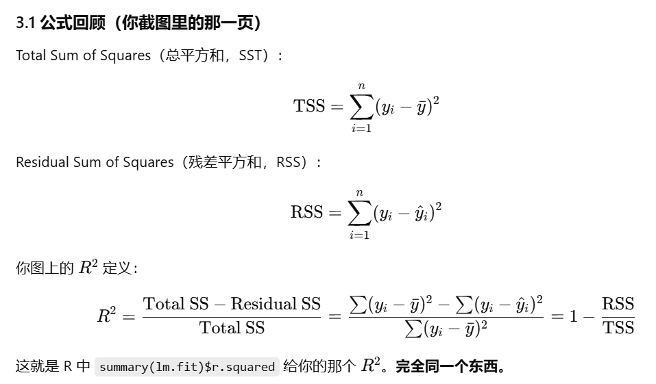
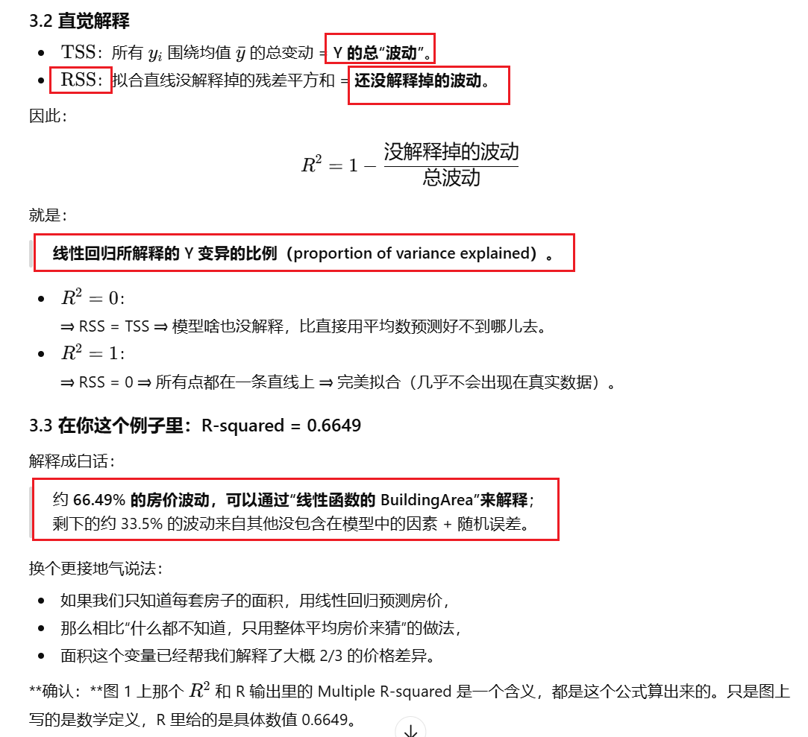
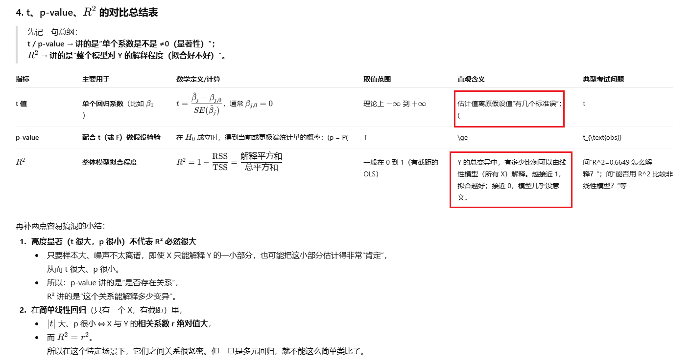
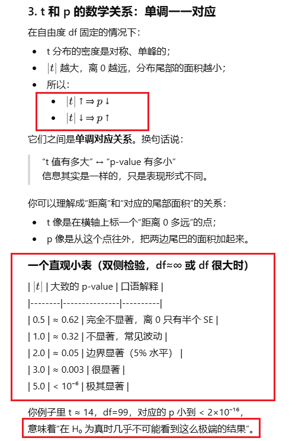

# w2: Regression and Smoothing（回归与平滑）

## 1. 知识点

### 1. Big picture & learning goals（整体目标）

- Understand **statistical learning (统计学习)** ideas behind regression: using data to learn the relationship between a response and predictors.Week_02
- Be able to:
  - Formulate and interpret a **simple linear regression (简单线性回归)** model.Week_02
  - Carry out **inference (统计推断)** for regression coefficients: standard errors, confidence intervals, hypothesis tests.Week_02
  - Distinguish **parametric methods (参数方法)** vs **non-parametric methods (非参数方法)**.Week_02
  - Understand **data smoothing (数据平滑)**: local averaging, k-nearest neighbours smoother, regression splines, LOESS.
- Recommended reading: **ISLR** Chapter 2 Statistical Learning, Chapter 3 Linear Regression, Chapter 7.4–7.6 Smoothing.Week_02

------

### 2. Simple linear regression（简单线性回归）





### 3. Least Squares Equations & Idea of Least Squares（最小二乘思想）



#### 1. Least Squares Equations（最小二乘方程）

通过简单线性回归模型，可以推导出斜率和截距的最小二乘估计。

##### 1.1 模型设定

我们考虑简单线性回归（simple linear regression）模型：

$$
y_i = \beta_0 + \beta_1 x_i + \varepsilon_i,\quad i = 1,\dots,n
$$

其中：

- $y_i$：第 $i$ 个观测的响应变量（response / dependent variable）
- $x_i$：第 $i$ 个观测的自变量（predictor / independent variable）
- $\beta_0, \beta_1$：真实但未知的截距和斜率（parameters）
- $\varepsilon_i$：误差项（error）

用数据估计得到回归线：

$$
\hat{y}_i = b_0 + b_1 x_i
$$

这里的 $b_0, b_1$ 是最小二乘估计（least squares estimates）。

---

##### 1.2 斜率（slope / regression coefficient）

最小二乘法得到的斜率估计为：

$$
b_1 =
\frac{\sum_{i=1}^n (x_i - \bar{x})(y_i - \bar{y})}
     {\sum_{i=1}^n (x_i - \bar{x})^2}
= \frac{\mathrm{Cov}(x,y)}{\mathrm{Var}(x)}
$$

其中：

- 样本均值  
  $$
  \bar{x} = \frac{1}{n}\sum_{i=1}^n x_i,\qquad
  \bar{y} = \frac{1}{n}\sum_{i=1}^n y_i
  $$

- 样本协方差  
  $$
  \mathrm{Cov}(x,y) = \frac{1}{n}\sum_{i=1}^n (x_i - \bar{x})(y_i - \bar{y})
  $$

- 样本方差  
  $$
  \mathrm{Var}(x) = \frac{1}{n}\sum_{i=1}^n (x_i - \bar{x})^2
  $$

直观理解：

> 斜率 $b_1 =$ “$x$ 与 $y$ 一起变化的程度（协方差）”  
> 除以 “$x$ 自身变化的程度（方差）”。

---

##### 1.3 截距（intercept）

截距估计为：

$$
b_0 = \bar{y} - b_1 \bar{x}
$$

因此，最小二乘回归线一定经过样本均值点 $(\bar{x}, \bar{y})$：

$$
\hat{y}(\bar{x}) = b_0 + b_1 \bar{x} = \bar{y}
$$

---

##### 1.4 估计回归线（estimated regression line）

代入 $b_0, b_1$，得到估计回归函数：

$$
\hat{y} = \hat{f}(x) = b_0 + b_1 x
$$

这条直线就是 **least squares regression line（最小二乘回归线）**。

---

#### 2. Idea of Least Squares（最小二乘思想）

##### 2.1 残差与残差平方和

对给定的一条直线 $\hat{y}_i = b_0 + b_1 x_i$，第 $i$ 个观测的 **残差（residual）** 为：

$$
e_i = y_i - \hat{y}_i = y_i - (b_0 + b_1 x_i)
$$

**残差平方和（Residual Sum of Squares, RSS）** 定义为：

$$
S(b_0, b_1)
= \sum_{i=1}^n e_i^2
= \sum_{i=1}^n \big(y_i - (b_0 + b_1 x_i)\big)^2
$$

---

##### 2.2 最小二乘法的核心思想

最小二乘法（Least Squares）的核心思想是：

> 在所有可能的直线中，选择那一条，使得  
> **残差平方和 $S(b_0, b_1)$ 尽可能小**。

也就是解下面的优化问题：

$$
(b_0, b_1)
= \arg\min_{(b_0, b_1)}
\sum_{i=1}^n \big(y_i - b_0 - b_1 x_i\big)^2
$$

为什么要用“平方和”？

1. 把正负误差都变成正数，避免互相抵消；
2. 平方放大了大误差的影响，更强烈惩罚离群点；
3. 数学上可以求导，容易得到解析解。

---

##### ==2.3 从“最小化”推导 $b_0$ 和 $b_1$==

把残差平方和视为 $b_0, b_1$ 的函数：

$$
S(b_0, b_1) = \sum_{i=1}^n (y_i - b_0 - b_1 x_i)^2
$$

对 $b_0, b_1$ 分别求偏导并令其为 0：

$$
\frac{\partial S}{\partial b_0} = 0,\qquad
\frac{\partial S}{\partial b_1} = 0
$$

解这个 $2\times 2$ 的“normal equations（正规方程）”，就得到：

$$
b_1 =
\frac{\sum_{i=1}^n (x_i - \bar{x})(y_i - \bar{y})}
     {\sum_{i=1}^n (x_i - \bar{x})^2},
\qquad
b_0 = \bar{y} - b_1 \bar{x}.
$$

---

##### 2.4 最小二乘带来的重要性质

由上述条件还可以推得一些重要性质：

1. **残差和为 0**

   $$
   \sum_{i=1}^n e_i = 0
   $$

2. **残差与自变量线性不相关**

   $$
   \sum_{i=1}^n x_i e_i = 0
   $$

   表示：用 OLS 拟合之后，残差中已经不再含有可以由 $x$ 线性解释的系统性信息。

3. **回归线必然经过样本均值点**

   由 $b_0 = \bar{y} - b_1 \bar{x}$ 可知，当 $x = \bar{x}$ 时：

   $$
   \hat{y} = b_0 + b_1 \bar{x} = \bar{y},
   $$

   因此回归线必定通过 $(\bar{x}, \bar{y})$。

---

#### 3. 名字与性质：为什么叫 least squares regression line？

- 这条线 **minimises the residual sum of squares**，所以叫  
  **least squares regression line（最小二乘回归线）**。
- 在以下经典假设下（线性、无多重共线性、严格外生性、误差独立同分布且方差齐性、误差正态等），
  最小二乘估计具有 **BLUE（Best Linear Unbiased Estimator）** 性质：
  - **Linear**：估计量是 $y$ 的线性组合；
  - **Unbiased**：$E[b_0] = \beta_0,\ E[b_1] = \beta_1$；
  - **Best**：在所有线性无偏估计量中方差最小。

---

#### 4. 一句考试用总结（背诵版）



对简单线性回归模型

$$
y_i = \beta_0 + \beta_1 x_i + \varepsilon_i,
$$

最小二乘法通过最小化

$$
\sum_{i=1}^n (y_i - b_0 - b_1 x_i)^2
$$

得到参数估计

$$
b_1 =
\frac{\sum_{i=1}^n (x_i - \bar{x})(y_i - \bar{y})}
     {\sum_{i=1}^n (x_i - \bar{x})^2}
= \frac{\mathrm{Cov}(x,y)}{\mathrm{Var}(x)},
\qquad
b_0 = \bar{y} - b_1 \bar{x}.
$$

这条直线经过 $(\bar{x}, \bar{y})$，并在所有直线中使残差平方和最小，因此称为 **least squares regression line（最小二乘回归线）**；在经典假设下，它还是 **BLUE（Best Linear Unbiased Estimator）**。

------

### 3. Inference for Regression（回归中的统计推断）

本节内容：
- 标准误（standard errors）
- 置信区间与显著性检验（confidence intervals & tests）
- 模型假设 / Gauss–Markov 条件
- 异方差性（heteroskedasticity）及其后果

---

#### 3.1 Standard Errors（标准误）

##### 3.1.1 样本均值的标准误

对一个总体均值 $\mu$，用样本均值 $\hat{\mu} = \bar{Y}$ 作为估计量时：

$$
\hat{\mu} = \bar{Y}
$$

在经典 i.i.d. 假设下：

$$
\mathrm{Var}(\hat{\mu}) = \frac{\sigma^2}{n}, 
\qquad
\mathrm{SE}(\hat{\mu}) = \frac{\sigma}{\sqrt{n}}.
$$

- $\sigma^2$：单个观测 $Y_i$ 的方差（总体方差）
- $\mathrm{SE}(\hat{\mu})$：均值估计的标准误（standard error of the mean）

---

##### 3.1.2 回归系数的标准误

线性回归模型：

$$
Y_i = \beta_0 + \beta_1 X_i + \varepsilon_i,\quad i = 1,\dots,n
$$

最小二乘估计得到截距和斜率：

- 截距估计：$\widehat{\beta_0}$
- 斜率估计：$\widehat{\beta_1}$

在经典线性模型假设下（同方差、无自相关等），它们的标准误为：

$$
\mathrm{SE}(\widehat{\beta_0}) 
= 
\sigma \sqrt{\frac{1}{n} + \frac{\bar{x}^2}{\displaystyle \sum_{i=1}^n (x_i - \bar{x})^2}},
$$

$$
\mathrm{SE}(\widehat{\beta_1}) 
= 
\frac{\sigma}{\sqrt{\displaystyle \sum_{i=1}^n (x_i - \bar{x})^2}}.
$$

其中：

- $\bar{x} = \dfrac{1}{n}\sum_{i=1}^n x_i$ 为自变量 $X$ 的样本均值
- 分母 $\sum_{i=1}^n (x_i - \bar{x})^2$ 越大，说明 $X$ 的变异越大，斜率估计越精确 → 标准误越小

> 实际应用中 $\sigma$ 是未知的，因此需要用残差来估计。

---

##### 3.1.3 用残差估计 $\sigma$

通常用残差平方和（RSS）估计误差方差：

$$
\widehat{\sigma}^2 
= 
\frac{1}{n - 2} \sum_{i=1}^n \hat{\varepsilon}_i^2
=
\frac{1}{n - 2} \sum_{i=1}^n \big( y_i - \widehat{\beta_0} - \widehat{\beta_1} x_i \big)^2.
$$

- 分母是 $n - 2$，因为我们估计了两个参数（$\beta_0, \beta_1$），自由度为 $n - 2$。
- 然后把 $\sigma$ 用 $\widehat{\sigma}$ 替换，得到实际的标准误估计：

$$
\widehat{\mathrm{SE}}(\widehat{\beta_0}),\quad
\widehat{\mathrm{SE}}(\widehat{\beta_1}).
$$

---

#### ==3.2 Confidence Intervals & Tests（置信区间与显著性检验）==

##### 3.2.1 原假设与检验统计量

在简单线性回归中，一个常见的检验目标是：

> 检验自变量 $X$ 与因变量 $Y$ 之间是否存在 **线性关系**。

典型的原假设（null hypothesis）：

$$
H_0 : \beta_1 = 0
\quad\text{（no linear relationship，无线性关系）}
$$

备择假设（two-sided）：

$$
H_1 : \beta_1 \neq 0.
$$

**检验统计量（test statistic）：**

$$
t 
= \frac{\widehat{\beta_1}}{\mathrm{SE}(\widehat{\beta_1})}.
$$

在误差为正态且模型假设成立时，$t$ 统计量在 $H_0$ 下服从自由度为 $n-2$ 的 t 分布：

$$
t \sim t_{n-2} \quad \text{under } H_0.
$$

---

##### 3.2.2 95% 置信区间（for $\beta_1$）

$\beta_1$ 的 $95\%$ 置信区间为：

$$
\widehat{\beta_1} 
\pm 
t_{n-2,\;0.975} \cdot \mathrm{SE}(\widehat{\beta_1}),
$$

其中：

- $t_{n-2,\;0.975}$ 是自由度为 $n-2$ 的 t 分布上 $97.5\%$ 分位数  
  （因为两侧各留 $2.5\%$，合计 $5\%$）。

**解释（interpretation）：**  

- 如果该置信区间 **不包含 0**，则有证据认为 $\beta_1 \neq 0$，即存在线性关联；
- 如果置信区间 **包含 0**，则数据不足以拒绝“无线性关系”的假设。

---

#### 3.3 Model Assumptions（模型假设 / Gauss–Markov 条件）

为了使 OLS(最小二乘估计) 是 BLUE（最佳线性无偏估计），并且上述检验与置信区间是有效的，我们需要若干模型假设（Gauss–Markov 条件）。

##### 3.3.1 Linearity（线性假设）

真实的条件期望是“参数线性”的：

$$
\mathbb{E}(Y \mid X) = \beta_0 + \beta_1 X.
$$

- 这里的“线性”是指对参数 $\beta_0, \beta_1$ 线性，而不是要求 X 本身不能做变换（例如可以在模型中放入 $X^2$，那依然是对参数线性）。

---

##### 3.3.2 No Perfect Multicollinearity（无完全共线性）

- 在简单线性回归中（只有一个 $X$），这个条件自动满足；
- 在多元回归中，多个自变量之间 **不能是精确的线性函数关系**，例如不能有：
  $$
  X_3 = 2 X_1 - X_2
  $$
- 一旦存在完全共线性，设计矩阵不可逆，OLS 解不存在或不唯一。

---

##### 3.3.3 Strict Exogeneity（严格外生性）

误差项在给定自变量时的条件期望为 0：

$$
\mathbb{E}(\varepsilon \mid X) = 0.
$$

- 意义：在给定 $X$ 之后，误差的平均为 0，不系统性偏向正或负；
- 确保 OLS 估计 **无偏**：$\mathbb{E}(\widehat{\beta_0}) = \beta_0$，$\mathbb{E}(\widehat{\beta_1}) = \beta_1$。

---

##### 3.3.4 Spherical Errors（球形误差）

“球形误差”通常包括以下两点：

1. **同方差性（homoskedasticity）**  

   所有误差具有相同的方差：

   $$
   \mathrm{Var}(\varepsilon_i) = \sigma^2,\quad \forall i.
   $$

2. **无自相关（no autocorrelation）**  

   不同观测之间的误差不相关：

   $$
   \mathrm{Cov}(\varepsilon_i, \varepsilon_j) = 0,\quad i \neq j.
   $$

在加上误差正态分布假设时：

- 可以得到 t 检验、F 检验的**精确分布**（exact t/F tests）；
- 这就是经典线性模型的完整框架。

---

#### 3.4 Heteroskedasticity（异方差性）

##### 3.4.1 定义与直观

**异方差性（heteroskedasticity）**：误差的方差随 $X$ 的取值而变化：

$$
\mathrm{Var}(\varepsilon_i \mid X_i) = \sigma_i^2,
\quad \text{而不是同一个常数 } \sigma^2.
$$

典型现象：在残差 vs. 拟合值或残差 vs. 自变量的散点图中，残差呈“扇形”散开（fan out），方差随 $X$ 增大而变大或变小。

---

##### 3.4.2 异方差的后果

在异方差性下：

1. **OLS 系数仍然无偏（unbiased）**

   只要外生性（$\mathbb{E}(\varepsilon \mid X) = 0$）仍然成立，  
   则
   $$
   \mathbb{E}(\widehat{\beta_0}) = \beta_0,\quad
   \mathbb{E}(\widehat{\beta_1}) = \beta_1.
   $$

2. **但标准误和 p 值不再正确**

   - 传统公式推导出的 $\mathrm{SE}(\widehat{\beta})$ 假设了同方差；
   - 当存在异方差时，这些标准误会被低估或高估；
   - 结果：置信区间和显著性检验（t 检验、F 检验）的结论变得 **不可靠（unreliable）**。

---

##### 3.4.3 常见应对方法（思路）

在超出本周（Week 2）深度的内容中，常见解决思路包括：

1. **变量变换（transform variables）**

   - 对 $Y$ 使用对数变换、平方根变换等；
   - 有时可以稳定方差，使误差更接近同方差。

2. **稳健标准误（robust standard errors）**

   - 使用 heteroskedasticity-robust SE（例如“White robust SE”）；
   - 可以在存在异方差的情况下仍然进行“稳健”的 t/F 检验。

3. **加权最小二乘（weighted least squares, WLS）**

   - 若已知或可建模方差结构，可用权重 $w_i \propto 1/\sigma_i^2$；
   - 在合适的权重下，能恢复“等方差条件”并改善估计效率。

> 在当前课程阶段，你主要需要记住：  
> 异方差性 **不会破坏 OLS 系数的无偏性**，  
> 但会使传统的标准误和 p 值 **不再可信**，从而影响回归推断的可靠性。

#### ==3.5 反思总结：t 检验和 t 统计量， 置信区间：核心思想、公式与理解==

##### 3.1 典型原假设

在简单线性回归中，我们通常想检验：

> 自变量 \(X\) 和因变量 \(Y\) 之间是否存在**线性关系**。

典型的原假设（null hypothesis）为：

$$
H_0: \beta_1 = 0
$$

含义：**斜率为 0，即 \(X\) 和 \(Y\) 之间没有线性关系（no linear relationship）**。

---

##### 3.2 t 统计量的分布

在线性模型假设 + 同方差 + 误差正态分布的条件下，可以证明：

$$
\frac{\hat{\beta}_1 - \beta_1}{\mathrm{SE}(\hat{\beta}_1)} \sim t_{n-2},
$$

其中：

- \(\hat{\beta}_1\)：斜率的最小二乘估计（OLS estimate）
- \(\mathrm{SE}(\hat{\beta}_1)\)：\(\hat{\beta}_1\) 的标准误（standard error）
- \(t_{n-2}\)：自由度为 \(n-2\) 的 t 分布（因为估计了 \(\beta_0, \beta_1\) 两个参数）

特别地，在原假设 \(H_0: \beta_1 = 0\) 下，有：

$$
t 
= \frac{\hat{\beta}_1 - 0}{\mathrm{SE}(\hat{\beta}_1)}
= \frac{\hat{\beta}_1}{\mathrm{SE}(\hat{\beta}_1)}
\sim t_{n-2}.
$$

这里的 \(t_{n-2}\) 表示自由度为 \(n-2\) 的 t 分布。

---

##### 3.3 t 检验的操作步骤（考试套路）

1. **估计回归模型，算出：**
   - \(\hat{\beta}_1\)：斜率估计；
   - 残差平方和（RSS）：
     $$
     \mathrm{RSS} = \sum_{i=1}^n \hat{\varepsilon}_i^2
     $$
   - 误差方差估计：
     $$
     s^2 = \frac{\mathrm{RSS}}{n-2}
     $$
   - 斜率的标准误：
     $$
     \mathrm{SE}(\hat{\beta}_1)
     $$

2. **计算 t 统计量：**

   $$
   t_{\text{obs}} 
   = \frac{\hat{\beta}_1}{\mathrm{SE}(\hat{\beta}_1)}.
   $$

3. **选择显著性水平**（例如常用 \(\alpha = 0.05\)，双尾检验）。

4. **从 t 表查临界值：**

   查自由度为 \(n-2\) 的 t 分布的 \(97.5\%\) 分位点：
   $$
   t_{n-2,\,0.975}
   $$
   （因为双尾显著性水平为 \(5\%\)，左右各 \(2.5\%\)）。

5. **比较并做结论：**

   - 如果
     $$
     \bigl|t_{\text{obs}}\bigr| > t_{n-2,\,0.975},
     $$
     则 **拒绝 \(H_0\)**，认为斜率显著不为 0，有线性关系。
   - 如果
     $$
     \bigl|t_{\text{obs}}\bigr| \le t_{n-2,\,0.975},
     $$
     则 **不能拒绝 \(H_0\)**，数据不足以说明斜率显著不为 0。

---

##### 4. 置信区间：核心思想、公式与理解

##### 4.1 一般形式

任何一个“估计量 + t 检验”的组合，一般的 \(95\%\) 置信区间形式是：

$$
\text{估计值} \;\pm\; (\text{临界值}) \times (\text{标准误}).
$$

对于回归斜率 \(\beta_1\)，\(95\%\) 置信区间为：

$$
\hat{\beta}_1 \;\pm\; t_{n-2,\,0.975} \cdot \mathrm{SE}(\hat{\beta}_1),
$$

其中：

- \(t_{n-2,\,0.975}\)：自由度为 \(n-2\) 的 t 分布的 \(97.5\%\) 分位点  
  （双尾检验中，左右各 \(2.5\%\)，合计 \(5\%\)）。
- 大样本情况下，\(t_{n-2,\,0.975} \approx 1.96\)，接近标准正态的 \(z_{0.975}\)。

---

##### 4.2 置信区间是如何从 t 检验“反推”出来的

考虑更一般的原假设：

$$
H_0 : \beta_1 = \beta_{10},
$$

此时 t 统计量为：

$$
T 
= \frac{\hat{\beta}_1 - \beta_{10}}{\mathrm{SE}(\hat{\beta}_1)}
\sim t_{n-2} \quad \text{under } H_0.
$$

要“**不拒绝**”这个原假设，就要求 \(T\) 落在 t 分布的中间 \(95\%\) 区间内，即：

$$
-\,t_{n-2,\,0.975}
\;\le\;
\frac{\hat{\beta}_1 - \beta_{10}}{\mathrm{SE}(\hat{\beta}_1)}
\;\le\;
t_{n-2,\,0.975}.
$$

两边同乘 \(\mathrm{SE}(\hat{\beta}_1)\)，再对不等式进行整理，可以得到：

$$
\hat{\beta}_1 - t_{n-2,\,0.975} \cdot \mathrm{SE}(\hat{\beta}_1)
\;\le\;
\beta_{10}
\;\le\;
\hat{\beta}_1 + t_{n-2,\,0.975} \cdot \mathrm{SE}(\hat{\beta}_1).
$$

所有不会被拒绝的 \(\beta_{10}\) 组成了一个区间，而这个区间正是：

> \(\beta_1\) 的 \(95\%\) 置信区间。

所以，可以理解为：

> **95% 置信区间 = 把“一系列 t 检验的接受域”反过来看的结果。**

---

##### 4.3 与“是否包含 0”的关系

通常我们检验的是：

$$
H_0 : \beta_1 = 0.
$$

这时：

- 如果 **0 在置信区间内**，说明在 \(5\%\) 显著性水平下，  
  “\(\beta_1 = 0\)” 这一假设 **不能被拒绝**，  
  ⇒ **没有显著线性关系**。
- 如果 **0 不在置信区间内**，说明在 \(5\%\) 水平下，  
  “\(\beta_1 = 0\)” 会被 t 检验拒绝，  
  ⇒ **存在显著线性关系**。

因此：

> 「置信区间不含 0」 \(\Longleftrightarrow\) 「t 检验拒绝 \(H_0 : \beta_1 = 0\)」

这两种说法在数学上是完全等价的，只是呈现方式不同：

- t 检验：给出一个 t 值和 p-value；
- 置信区间：给出一段“合理的参数范围”。

---

##### 4.4 正确理解 95% 置信区间

标准（考试用）句式：

> We are 95% confident that the true slope \(\beta_1\) lies between \(L\) and \(U\).

更严谨的频率学派解释是：

> 如果我们**无限次**重复同样的抽样和建模过程，每一次都用同样的公式构造一个区间，那么大约 **95% 的区间会覆盖真实的 \(\beta_1\)**。

注意：

- 不是在说：“\(\beta_1\) 有 \(95\%\) 的概率在这一个区间里”。
- 在频率学派的框架下，\(\beta_1\) 被视为一个**固定常数**（不是随机的）；  
  真正随机的是我们抽到的样本和由此构造出的置信区间。

# ==补充理解这里：==计算题，总结公式

## 1. t value 的大小到底在说什么？



## 2. p-value 很小到底意味着什么？“小然后呢？”



## 3. R^2^ 





## 4. 对比总结





### 4. Parametric vs Non-parametric methods（参数 vs 非参数方法）

From the slides:Week_02

- **Parametric methods（参数方法）**
  - Choose a **fixed model form** (e.g. linear regression Y=β0+β1XY = \beta_0 + \beta_1 XY=β0+β1X).
  - Fit a **small number of parameters (少量参数)** such as slope and intercept.
  - Pros: simple, interpretable, easy inference.
  - Cons: can be badly wrong if the true relationship is **non-linear (非线性)**.
- **Non-parametric methods（非参数方法）**
  - Do **not assume a strict model form**; let the data “**speak for itself（数据自己说话）**”.
  - Examples: k-nearest neighbours smoother, regression splines, LOESS.
  - Pros: flexible, can capture complex shapes.
  - Cons: often less interpretable, can overfit, need more data, more computation.

Exam-style understanding: you should be able to **name** and **verbally describe** each method and say whether it is parametric or non-parametric.

------

### 5. Data smoothing & local averaging（数据平滑与局部平均）

**General smoothing model（平滑模型）**

- Assume a **non-linear** relationship:

  Y=f(X)+εY = f(X) + \varepsilonY=f(X)+ε

  where fff is an unknown smooth function. **Smoothing** is a **non-parametric method** to estimate fff.Week_02

**Local averaging idea（局部平均思想）**

- Most smoothers rely on **local averaging (局部平均)**:

  - Points with predictor values **near** xxx are given higher weights to estimate f(x)f(x)f(x).Week_02

- Generic form:

  f^(x)=average(Y∣X∈N(x)),\hat f(x) = \text{average} (Y \mid X \in N(x)),f^(x)=average(Y∣X∈N(x)),

  where N(x)N(x)N(x) is a neighbourhood around xxx.Week_02

- Contrast: **simple linear regression** fits **one global line (全局直线)** to all data.Week_02

------

### 6. k-nearest neighbours & running mean（k近邻与滑动平均）

**k-nearest neighbours smoother（k近邻平滑器）**

- For a target point xxx, define N(x)N(x)N(x) as:

  - The point at xxx itself,
  - The (k−1)/2(k-1)/2(k−1)/2 closest points **below** xxx,
  - The (k−1)/2(k-1)/2(k−1)/2 closest points **above** xxx.Week_02

- This is called the **symmetric nearest neighbourhood（对称最近邻域）**.

- The **running mean / moving average (滑动平均)** smoother:

  \hat f(x) = \text{mean}\left[ Y_j \text{ such that }  \max\left(i - \frac{k-1}{2},1\right) \le j \le  \min\left(i + \frac{k-1}{2}, n\right) \right]. \]:contentReference[oaicite:20]{index=20}  

**Key ideas you should remember**

- **Parameter kkk** is a **smoothing parameter (平滑参数)**:
  - **Small kkk**: very wiggly curve (low bias, high variance).
  - **Large kkk**: very smooth curve (higher bias, lower variance).
- kNN smoothing is **non-parametric** and purely data-driven.

------

### 7. Regression splines（回归样条）

From the slides:Week_02

- **Regression spline（回归样条）**:
  - Fit **piecewise polynomial (分段多项式)** functions joined at **knots (结点)**.
  - Each piece can be a **d-degree polynomial (d次多项式)**.
  - The spline is constrained to be **smooth and continuous (光滑连续)** across knots.
- A **cubic spline（三次样条）**:
  - Fits cubic polynomials.
  - Enforces continuity of:
    - the function itself,
    - the first derivative,
    - the second derivative at each knot.Week_02
- Advantages:
  - The resulting curve looks smooth to the eye.
  - Can fit almost any smooth function with enough knots.

You don’t need to memorise matrix formulas, but you **should** be able to explain in words what a regression spline is and why we use knots.

------

### 8. LOESS – local regression smoothing（LOESS 局部回归平滑）

From the slides:Week_02

- **LOESS / LOcal regrESSion（局部回归）**:
  - A **locally weighted scatterplot smoothing (局部加权散点平滑)** method.
  - For each xxx, fits a **local line (局部直线)** to points near xxx using a **robust method (稳健方法)** instead of simple least squares.
  - The smoother is **non-linear** overall because each location has its own fitted line.
  - LOESS is **computationally intensive** and needs **densely sampled data**.
- **Span parameter（跨度参数）**:
  - In `loess()` and `ggplot2::geom_smooth(method = "loess", span = ...)`,
  - **Larger span** → more smoothing, less sensitivity to local noise.Week_02

You should recognise LOESS plots and understand **how changing the span affects the curve**.

------

### 9. R skills from Week 2 workshop（第二周 workshop 中的 R 技能）

Workshop Week 2 uses the **Sonar dataset** and practises summary statistics and grouping:

- Compute **basic statistics（基本统计量）** for a variable:

  - `max(sonar$V1)`, `min(sonar$V1)`, `sd(sonar$V1)`, `mean(sonar$V1)` etc.
  - Understand shape of distribution, e.g. **right-skewed (右偏)**.Workshop_week2

- Use **`aggregate()`** to compute group-wise statistics:

  - Example from slides:

    ```
    aggregate(V1 ~ Class, data = sonar, FUN = median)
    ```

    gives median V1 for each Class (e.g. M vs R).Workshop_week2

- Tidyverse equivalent using **`group_by()`** + **`summarise()`**:

  ```
  sonar |>
    select(V1, Class) |>
    group_by(Class) |>
    summarise(median_V1 = median(V1))
  ```

Workshop_week2

**Link to regression & smoothing**

- These skills help you **explore relationships** before fitting models:
  - Compare means/medians across groups.
  - Look at variability and skewness.
- In Week 2 and later you combine:
  - **Numerical summaries & plots** +
  - **Regression / smoothing models**.

------

### 10. Typical exam-style things to be ready for（建议重点备考点）

For Week 2, be ready to:

1. **Write down and interpret** the simple linear regression model
   - Explain the role of β0,β1,ε\beta_0, \beta_1, \varepsilonβ0,β1,ε.
2. **Explain least squares** and **RSS** and give the formulas for b0,b1b_0, b_1b0,b1.
3. **Describe assumptions** (linearity, exogeneity, spherical errors) and what happens under heteroskedasticity.
4. **Interpret R output** from `lm()`:
   - Coefficients, standard errors, t-values, p-values, R², residual standard error.Week_02
5. **Explain**:
   - Parametric vs non-parametric methods.Week_02
   - kNN smoother, regression spline, LOESS, and the role of smoothing parameters (k, span, number of knots).
6. **Use R patterns**:
   - `lm(y ~ x, data = ...)`, `confint()`, `predict()`,
   - basic summaries (`mean`, `sd`, `max`, `min`) and group summaries with `aggregate()` / `group_by()` + `summarise()`.

### 11. 补充学习Here的作用

#### 一、here() 是怎么决定根目录的？

`here` 包的逻辑大致是：

1. ==**当你加载 `library(here)` 时，它会决定一个 root 目录**，==之后 `here()` 全部相对于这个 root。
2. 决定 root 的优先级大概是：
   - 当前 RStudio Project 的根目录（有 `.Rproj` 的那个文件夹）
   - 当前工作目录 `getwd()` 向上查找有没有 `.here`、`.git` 等标记
3. **一旦 root 决定好了，这个会话里就固定不变了**，除非你用 `here::i_am()` 重新指定，或者卸载并重新加载 `here`。

你现在的现象是：

- `.here` 在：`E:\Au_notes\5003STAT\final exam\.here`
- 脚本在：`E:\Au_notes\5003STAT\final exam\w2\w2.R`
- 但 `here()` 输出是“桌面路径”。

这说明：你当前的 R / RStudio 很可能是**从桌面某个 Project 启动的**，或者你之前在桌面路径下 `library(here)` 过，于是这里的 root 就被“锁死”在桌面那里，之后你在 `E:\...` 运行脚本也不会变。

> 换句话说：`here()` 现在是“桌面那个项目”的 `here()`，
>  它根本不知道你在 E: 盘又放了一个 `.here` 文件。

------

#### 二、为什么在 `w2.R` 里面看不到上一级 `.here`？

因为 `here` 不是“从当前脚本目录往上找”，而是“从当前**项目根**往上找”。

目前的 root 仍然是桌面，所以它的搜索路径像这样：

```
C:\Users\你\Desktop
C:\Users\你
C:\
...
```

在这条链上当然看不到 `E:\Au_notes\5003STAT\final exam\.here`，
 所以 `here()` 只能老老实实返回“桌面”。

------

#### 三、推荐解决方案（任选一种或组合）

##### 方案 1（最推荐）：把 `final exam` 变成一个 RStudio Project

这是最符合 RStudio / here 习惯的做法。

1. 打开 RStudio。

2. 菜单：**File → New Project → Existing Directory**。

3. 选中目录：
    `E:\Au_notes\5003STAT\final exam`

4. RStudio 会在这个目录下创建一个 `final exam.Rproj`。

5. 双击这个 `.Rproj` 打开 RStudio，以后**都从这个项目打开相关脚本**。

6. 在 Console 里输入：

   ```
   library(here)
   here()
   ```

   现在应该返回：`E:/Au_notes/5003STAT/final exam`（或类似）。

7. 再在 `w2.R` 里调用：

   ```
   here("data", "xxx.csv")
   ```

   相对的就是：`E:\Au_notes\5003STAT\final exam\data\xxx.csv`。

> 只要你是通过这个 `.Rproj` 打开的项目，哪怕 `w2.R` 在子文件夹，
>  `here()` 都会用 `final exam` 当根目录，就不用管 `.here` 了，甚至可以删掉 `.here`。

------

##### 方案 2：在脚本里用 `here::i_am()` 手动指定根目录

如果你不想建 RStudio Project，可以在脚本开头写：

```
library(here)

# 告诉 here：这个脚本属于哪个项目
here::i_am("w2/w2.R")
```

`i_am()` 的含义：

> “以当前脚本路径作为参照，把‘w2/w2.R’这条相对路径解释出来，
>  然后把它的上级目录当成项目根目录。”

假设 `w2.R` 真实位置就是 `E:\Au_notes\5003STAT\final exam\w2\w2.R`，
 那 `i_am("w2/w2.R")` 执行后：

- `here()` 会变成：`E:\Au_notes\5003STAT\final exam`
- `here("data", "xxx.csv")` 就是 `E:\Au_notes\5003STAT\final exam\data\xxx.csv`

> 注意：`i_am()` 要在每次新开 R 会话、重新跑脚本时执行一次，
>  一般就放在脚本最前面即可。

------

##### 方案 3：重启 + 先 setwd，再加载 here

如果你习惯用 `.here`，可以这样“重置”：

1. **关闭 R / RStudio，重新打开**。

2. 在 Console 里先手动切到目标目录：

   ```
   setwd("E:/Au_notes/5003STAT/final exam")
   ```

3. 再加载 `here`：

   ```
   library(here)
   here()
   ```

   这时它会从当前工作目录开始向上找 `.here`，
    就会找到你放在 `final exam` 里的那个 `.here`。

> 关键点：**一定要在 `library(here)` 之前就把工作目录设好**，
>  否则 root 会锁在别的地方。

如果你在同一个会话里之前已经 `library(here)` 过了，可以这样“洗掉”：

```
detach("package:here", unload = TRUE)   # 卸载
setwd("E:/Au_notes/5003STAT/final exam")
library(here)                           # 重新加载
here()
```

### 12. 补充打开R的方式

#### 1. PowerShell 里 `w2.R` 为啥报错？怎么从命令行运行 R 脚本？

你在 pwsh 里敲的是：

```
PS E:\Au_notes\5003STAT\finalExam\w2> w2.R
```

PowerShell 的逻辑是：

- 它会把 `w2.R` 当成一个“命令名”，在 PATH 里找一个叫 `w2.R` 的可执行程序

- 当前目录的文件**默认不会被当作命令**，所以会提示：

  > The command "w2.R" was not found ...

如果真的要从命令行跑 R 脚本，标准方式是：

```
cd E:\Au_notes\5003STAT\finalExam\w2

# 1. 如果 Rscript 在 PATH 里（安装 R 默认会有）
Rscript w2.R

# 2. 或者写全路径（根据你自己 R 的安装目录改）
"C:\Program Files\R\R-4.4.1\bin\Rscript.exe" w2.R
```

PowerShell 提示你可以用：

```
.\w2.R
```

这只是说明“这是当前目录下的文件”，但 Windows 默认也不会直接把 `.R` 当可执行程序运行，仍然需要 `Rscript` 这个解释器。

> 想要“管理员权限”的话，只需要用**管理员身份打开 PowerShell**，再运行 `Rscript w2.R` 就可以了。但是你现在这个读 csv 的问题，不需要这么麻烦。

### 13. 补充一个移除的方法Using the `subset()` function and `select` to remove the `Class` column.

sonar_remove <- subset(sonar, select = -Class)

## 2. 代码 Base R 与 tidyverse 笔记

第二周的tutorial 和第一周的任务完全重合，只是数据集不同，所以我在这里根据之前的笔记来做出拓展。

```R
# 重点内容:
# 1. 读取数据
read.csv(`stringsAsFactors`: 是否自动把字符转为因子（R4.0+ 默认为 `FALSE`）)

# 2. 常用函数
head(df)        # 查看前6行
class(df)       # 对象类型（data.frame / tibble 等）
colnames(df)    # 列名
dim(df)         # 行数 + 列数
nrow(df)        # 行数
ncol(df)        # 列数
summary(df)     # 每列的统计摘要（最小值、分位数、均值等）
str(df)         # 结构（见后文详细）

# 3. 常用：
$, pull()得到的都是向量, select得到的是df

filter(col = "")按列筛选

# 按照Class 来分得到V1的中位数
aggregate(V1 ~ Class, data = sonar, FUN = median)

```

本周核心目标：

- 理解并能操作 **基础数据结构**：
  - `data.frame`
  - `factor`
  - `vector`
  - `matrix`
- 能完成 **CSV 文件的读写**。
- 会做 **数值汇总与图形汇总**。
- 会进行 **筛选与子集化（subsetting / filtering）**。

这些能力是后续数据清洗、建模与可视化的基础。

---

## 一、读取与查看基础表格信息

### 1. `read.csv()`：读入 CSV

```r
df <- read.csv("path/to/file.csv",
               stringsAsFactors = FALSE)  # R4.0+ 默认 FALSE
```

常见参数：

- `file`: 文件路径
- `header`: 第一行是否是列名（默认 `TRUE`）
- `sep`: 分隔符（逗号为`,`）
- `stringsAsFactors`: 是否自动把字符转为因子（R4.0+ 默认为 `FALSE`）

### 2. 常用查看函数

```R
head(df)        # 查看前6行
class(df)       # 对象类型（data.frame / tibble 等）
colnames(df)    # 列名
dim(df)         # 行数 + 列数
nrow(df)        # 行数
ncol(df)        # 列数
summary(df)     # 每列的统计摘要（最小值、分位数、均值等）
str(df)         # 结构（见后文详细）
```

### 3. 写 CSV：`write.csv()`

```
write.csv(df,
          file = "output.csv",
          row.names = FALSE)   # 一般设为 FALSE，避免把行号写成第一列
```

常见习惯：

- 写出子集：

  ```
  sub_df <- subset(df, 条件)   # 或 df[条件, ]
  write.csv(sub_df, "sub.csv", row.names = FALSE)
  ```

## 二、数据结构（Data Structures）

### 1. Data Frame

**本质**：表格型数据。每列可以是不同类型（numeric / character / factor）。
 **子集操作**：`data[row, col]`，列也可以通过 `$` 或列名索引。

#### 1.1 取列与取子集

```
cal <- df$calories
class(cal)   # 通常是 numeric / integer 向量

# 取多列（按列名）
sub_cal1 <- df[, c("calories", "name", "mfr")]
class(sub_cal1)   # data.frame

# 取多列（按列下标）
sub_cal2 <- df[, c(1, 3, 5)]
sub_cal3 <- df[, 1:5]
```

> `$` 只能一次取 **一列**，且列名必须写死在代码里；
>  想一次取多列要用 `[` 方式。

#### 1.2 单列“降维”与 `drop = FALSE`

默认情况下：

```
x <- df[, "name"]   # 返回一个向量（会降维）
class(x)            # "character"
```

如果需要保持为 data.frame：

```
sub_cal4 <- df[, "name", drop = FALSE]
class(sub_cal4)     # "data.frame"
```

规则：

- `df[ , ]`：常规子集化，是否降维由 `drop` 决定（默认 `TRUE`）。
- `df[[ ]]`：取“一个元素”（一列），返回向量，支持用变量名或下标。
- `df$列名`：仅能写字面量列名，不支持变量；仍返回向量。

#### 1.3 行筛选（filter rows）

```
sub_cal5 <- df[df$mfr == "K", ]      # base R 写法
# 等价于：subset(df, mfr == "K")
```

------

### 2. `str()`：查看对象结构

```
str(x)
```

- `x` 可以是向量、列表、data.frame、模型结果等。

- 输出示例：

  ```
  str(cereal)
  
  'data.frame': 77 obs. of  16 variables:
   $ name   : chr "100% Bran" "All-Bran" ...
   $ mfr    : chr "K" "K" "Q" ...
   $ type   : chr "C" "C" "H" ...
   ...
  ```

含义：

- `77 obs.`：77 行观测
- `16 variables`：16 列变量
- 每列的类型如 `chr`（character）、`num`（numeric）、`Factor` 等

------

### 3. Factor（因子）

**用途**：表示类别型变量（categorical variable），带有限的水平 `levels`。

#### 3.1 因子本质

- R 内部：因子 = **整数编码 + `levels` 属性**。

  ```
  levels(mfr)      # 比如 c("Ford", "BMW", "Toyota")
  ```

- 实际存储为 1, 2, 3 等编号。

#### 3.2 `stringsAsFactors`

- 在 base R 的 `data.frame()` / `read.table()` / `read.csv()` 等函数中有参数：

  ```
  data.frame(..., stringsAsFactors = TRUE)
  ```

- `TRUE`：字符串列会**自动转为因子**。

- `FALSE`：保留为字符型（R4.0+ 默认）。

推荐做法：

1. 读入时先保留为 `character`。
2. 对真正的分类变量再手动 `factor()`。

#### 3.3 为什么要用因子？

1. **建模时自动作为分类变量处理**

   ```
   lm(y ~ mfr, data = df)
   ```

   - 如果 `mfr` 是 factor：自动产生哑变量（dummy variables）。
   - 如果是 character：有的函数会自动转 factor，有的会报错或行为不一致。

2. **分组汇总 / 作图更自然**

   ```
   ggplot(df, aes(x = type)) + geom_bar()
   ```

   - type 为因子时：x 轴按 level 排列。

   - 可以控制顺序：

     ```
     df$type <- factor(df$type,
                       levels = c("small", "midsize", "large", "suv"))
     ```

3. **固定类别集合，防止“打字错误”变成新类别**

   ```
   df$type[1] <- "超大车"  # 不在 levels 中
   # 会产生 NA / warning，不会悄悄增加新水平
   ```

4. **在大数据中更省内存**

   - 重复字符串多时，用因子的整数编码 + levels 列表更紧凑。

#### 3.4 什么时候不适合用因子？

- 自由文本：评论、地址、备注等，适合 `character`。

- 需要频繁做字符串处理（`substr`、`grep`、`stringr` 等）时，因子会增加 `as.character()` 的麻烦。

- **常见坑**：把因子直接 `as.numeric()`：

  ```
  x <- factor(c("10","20","30"))
  as.numeric(x)              # 得到 1,2,3，而不是 10,20,30
  as.numeric(as.character(x))# 这样才是 10,20,30
  ```

------

### 4. Vector（向量）

**用途**：同类型元素的一维序列，是 R 中最基本的结构。

常见操作：

```
x <- 1:10
length(x)        # 长度
x[5:10]          # 第 5–10 个元素
x[c(1, 3, 5)]    # 指定位置
x[-1]            # 删除第一个（返回删除后的新向量）
```

> 负索引不会修改原向量，只是返回新结果；要修改需要重新赋值。

#### 4.1 `select()` 与 `pull()`

```
cereal.calories <- cereal |>
  select(calories) |>   # 只剩一列（仍是 tibble/data.frame）
  pull()                # 把这一列取成向量
```

- `select()`：选择列（结果仍是 data.frame / tibble）。
- `pull()`：从数据框中取出一列，变为普通向量。

等价更简洁写法：

```
cereal.calories <- cereal |> pull(calories)
# 或 base R：
cereal.calories <- cereal$calories
cereal.calories <- cereal[["calories"]]
```

------

### 5. Matrix（矩阵）

**特性**：矩阵中所有元素必须是**同一类型**。

#### 5.1 Data Frame vs Matrix

- Data frame / tibble：
  - 每列类型可不同（数值、字符、因子……）。
- Matrix：
  - 所有元素同一类型（全部 numeric 或全部 character）。

常用于：

- 矩阵乘法 `%*%`、转置 `t()`。
- 线性代数操作：`eigen()`、`svd()`。
- 一些只接受矩阵的算法（PCA、聚类等）。

#### 5.2 `as.matrix()` 的影响

```
m_all_char <- as.matrix(cereal)      # 含字符列 → 全变字符
num_only <- cereal[, !(names(cereal) %in% c("mfr", "name", "type"))]
m_numeric <- as.matrix(num_only)     # 仅数值列 → 数值矩阵
mode(m_all_char[1,1])
mode(m_numeric[1,1])
```

- 若包含字符/因子列，`as.matrix()` 会把所有列提升为最“通用”的类型（通常是 `character`）。

- 若只保留数值列，再转矩阵，则得到 numeric matrix，更适合做数值运算：

  ```
  cereal.num <- cereal |> dplyr::select(where(is.numeric))
  cereal.mat <- as.matrix(cereal.num)
  ```

示例用途：

```
prcomp(cereal.mat, scale. = TRUE)         # PCA
kmeans(cereal.mat, centers = 3)           # 聚类
apply(cereal.mat, 2, mean)                # 每列均值
```

## 三、数值汇总（Numerical Summaries）

### 1. 基本汇总

```
summary(df$sodium)                         # 给出 Min, 1st Qu., Median, Mean, 3rd Qu., Max
quantile(df$sodium,
         probs = c(.25, .5, .75, .8),
         na.rm = TRUE)
mean(df$sodium, na.rm = TRUE)
sd(df$sodium, na.rm = TRUE)
```

- `na.rm = TRUE`：忽略缺失值 `NA`。

### 2. 分组汇总：`tapply()` 与 `aggregate()`

#### 2.1 `tapply(X, INDEX, FUN, ...)`

```
tapply(X = cereal$sodium,
       INDEX = cereal$mfr,
       FUN = mean,
       na.rm = TRUE)
```

- `X`：要汇总的向量。
- `INDEX`：分组因子（一个或多个）。
- `FUN`：应用的函数（`mean`、`sum` 等）。

#### 2.2 `aggregate(y ~ group, data =, FUN =, ...)`

公式语法：

```
aggregate(sodium ~ mfr,
          data = cereal,
          FUN = mean)
```

- 公式左边：要汇总的目标变量 `sodium`。
- 右边：分组变量 `mfr`。
- 返回 data.frame：每组一行。

按多个变量分组：

```
aggregate(sodium ~ mfr + type,
          data = cereal,
          FUN = mean)
```

一次汇总多个数值变量：

```
aggregate(cbind(sodium, calories, sugars) ~ mfr,
          data = cereal,
          FUN = mean)
```

自定义带 `na.rm` 的函数：

```
aggregate(sodium ~ mfr,
          data = cereal,
          FUN = function(x) mean(x, na.rm = TRUE))
```

------

### 3. `%in%` 运算符

**作用**：集合成员运算符，用于多值筛选。

```
x %in% y    # 对 x 的每个元素，判断是否属于集合 y，返回 TRUE/FALSE 向量

df_sub <- df[df$mfr %in% c("K", "G"), ]
```

------

### 4. 公式中的 `~` 用法

**在汇总中：**

```
aggregate(sodium ~ brand, data = df, FUN = mean)
# 读作：“按 brand 分组，汇总 sodium 的均值”
```

**在图形中：**

```
boxplot(sodium ~ brand, data = df)
# 读作：“画 sodium 按 brand 分组的箱线图”
```

------

### 5. `names()` 函数

```
names(x)             # 取名称（向量名 / 列名）
names(x) <- c("a", "b")   # 改名
names(x) <- NULL          # 去掉名字
```

- 对 data.frame：`names(df)` 与 `colnames(df)` 基本等价。
- 对 matrix：通常用 `colnames()` / `rownames()`。

------

### 6. `.libPaths()`

```
.libPaths()   # 查看 R 包安装的库路径列表
```

## ==四、tidyverse 总览==

**tidyverse** 是一组为数据科学设计的 R 包家族，包括：

- `dplyr`：数据操作
- `ggplot2`：绘图
- `tidyr`：宽长表变形与数据整理
- `readr`：读写文本数据
- `tibble`：现代数据框
- `purrr`：函数式编程 / map 家族
- `stringr`：字符串处理
- `forcats`：因子处理

### 1. 总控包 `tidyverse`

```
library(tidyverse)         # 一次性加载核心包
tidyverse_packages()       # 列出 tidyverse 包
tidyverse_conflicts()      # 查看函数名冲突
tidyverse_update()         # 检查更新
```

------

## ==五、`dplyr`：数据操作动词库==

### 1. 行操作与排序

#### 1.1 `filter()`：按条件筛选行

```
filter(mtcars, cyl == 6, mpg > 20)         # 多个条件 AND
filter(mtcars, cyl %in% c(4, 6))           # 多值筛选
```

#### 1.2 `arrange()`：排序

```
arrange(mtcars, mpg)                       # 升序
arrange(mtcars, desc(mpg))                 # 降序
```

#### 1.3 `slice_*()`：按行号截取

```
slice_head(mtcars, n = 3)                  # 前3行
slice_tail(mtcars, n = 3)                  # 后3行
slice_min(mtcars, mpg, n = 5)              # mpg 最小的5行
slice_max(mtcars, mpg, n = 5)              # mpg 最大的5行
```

#### 1.4 随机抽样

```
sample_n(mtcars, 5)                        # 抽5行
sample_frac(mtcars, 0.1)                   # 抽10% 行
```

#### 1.5 `distinct()`：去重

```
distinct(mtcars, cyl, .keep_all = TRUE)             # 按 cyl 去重，保留第一行
distinct(mtcars, cyl, gear, .keep_all = TRUE)       # 按 (cyl, gear) 组合唯一
```

- `NA` 也会作为一种独立取值参与去重。

------

### 2. 列选择 / 重命名 / 位置调整

```
select(iris, Sepal.Length, Species)               # 选指定列
select(iris, starts_with("Sepal"))                # 按前缀
select(iris, where(is.numeric))                   # 所有数值列

rename(iris, sepal_len = Sepal.Length)            # 改列名：左=新名，右=旧名

relocate(iris, Species, .before = 1)              # 把 Species 移到最前
```

------

### 3. 新列与条件变换：`mutate()` / `transmute()`

```
mutate(mtcars, kpl = mpg * 0.425144)              # 新增列（英里/加仑 → km/L）

transmute(mtcars, kpl = mpg * 0.425144)           # 只保留新列
```

#### 3.1 条件分组：`case_when()`

```
mutate(mtcars,
       power = case_when(
         hp >= 200 ~ "high",
         hp >= 120 ~ "mid",
         TRUE      ~ "low"
       ))
```

#### 3.2 `across()`：批量对列应用函数

```
mutate(mtcars,
       across(where(is.numeric), scale))   # 所有数值列标准化
```

#### 3.3 `coalesce()`：向量级填充 NA

```
coalesce(c(NA, 1), 0)
# 结果: c(0, 1)   第一个 NA 被 0 替代
```

------

### 4. 分组与汇总：`group_by()` + `summarise()`

```
mtcars %>%
  group_by(cyl) %>%
  summarise(
    avg_mpg = mean(mpg, na.rm = TRUE),
    n       = n(),         # 组内行数
    max_hp  = max(hp)
  ) %>%
  arrange(desc(avg_mpg))
```

#### 4.1 快捷计数：`count()` / `add_count()`

```
count(mtcars, cyl)                      # 每个 cyl 的频数

add_count(mtcars, cyl, name = "n_cyl")  # 在原数据中添加一列 n_cyl，为组大小
```

- `n()`：仅在 `summarise()` / `mutate()` 的分组环境中使用，表示组内行数。
- `count(df, cyl, sort = TRUE)`：按频数降序。

------

### 5. 连接与绑定

#### 5.1 Join 系列

```
left_join(df1, df2, by = "id")   # 左连接：保留左表所有键
inner_join(df1, df2, by = "id")  # 内连接：交集
right_join(df1, df2, by = "id")  # 右连接：保留右表所有键
full_join(df1, df2, by = "id")   # 全连接：并集
```

#### 5.2 绑定行 / 列

```
bind_rows(df_a, df_b)   # 纵向拼接（行）
bind_cols(df_a, df_b)   # 横向拼接（列）
```

------

## 六、`ggplot2`：语法分层的绘图系统

### 1. 核心结构（语法）

> 数据 + 美学映射 `aes()` + 几何对象 `geom_*`
>
> - 统计变换 `stat_*` + 坐标 / 标度 / 主题

```
library(ggplot2)

ggplot(data = df,
       mapping = aes(x = x_var, y = y_var)) +
  geom_point()
```

### 2. 基本例子

```
ggplot(mpg, aes(displ, hwy)) + geom_point()

ggplot(mpg, aes(displ, hwy, color = class)) +
  geom_point()
```

------

### 3. 常见 `geom_*` 函数

- `geom_point()`：散点
- `geom_line()`：折线
- `geom_col()`：柱形（y 已汇总）
- `geom_bar()`：柱形（自动 `count`）
- `geom_histogram(bins = 30)`：直方图
- `geom_boxplot()`：箱线图
- `geom_violin()`：小提琴图
- `geom_density()`：核密度曲线
- `geom_smooth(method = "lm")`：拟合线（见后）
- `geom_jitter(width = .1)`：抖动散点
- `geom_text(aes(label = xxx))`：文字标注

------

### 4. 分面 / 坐标 / 标度 / 主题

```
facet_wrap(~ class)           # 单变量分面
facet_grid(drv ~ cyl)         # 行列分面

coord_flip()                  # 交换 x/y
coord_cartesian(xlim = c(a,b))# 裁剪可视区域

labs(title = "Title",
     x = "X", y = "Y")        # 轴标题、主标题

scale_x_log10()               # 对数轴

theme_minimal()
theme_classic()
theme_bw()
```

> 映射 vs 固定设置：
>  `aes(color = class)` 是映射（随数据变化）；
>  `color = "red"` 是固定值。

------

### 5. 典型复合图示例（要点总结）

1. **分类计数 + 比例条形图**：
   - 先 `count()` 汇总，再 `geom_col()`，配合 `position = "dodge"` / `"fill"`。
2. **时间序列 + 移动平均线**：
   - 用 `mutate()` 计算滚动平均，再 `geom_line()`。
3. **散点 + 分面 + 回归线**：
   - `geom_point()` + `geom_smooth(method = "lm")` + `facet_wrap()`。
4. **相关矩阵热图**：
   - 先 `cor()`，再 `as.data.frame(as.table())` 转长表，使用 `geom_tile()` + `geom_text()`。

（原文中对应页有多个例子，这里保留结构与关键词）

------

## 七、`tidyr`：数据整理与宽/长表变形

### 1. `pivot_longer()`：宽 → 长

```
iris_long <- iris |>
  pivot_longer(
    cols = starts_with("Sepal"), # 要“拉长”的列
    names_to  = "measure",       # 原列名变成的新列
    values_to = "value"          # 原数值放到的新列
  )
```

- 结果行数翻倍（因为两列被堆叠），`Species` 等未参与列保持为键。

### 2. `pivot_wider()`：长 → 宽

```
iris_wide <- iris_long |>
  pivot_wider(
    names_from  = "measure",   # 哪一列的取值变成列名
    values_from = "value"      # 哪一列提供数值
  )
```

- `names_to ↔ names_from`，`values_to ↔ values_from` 相互对应。

------

### 3. `separate()` 与 `unite()`

```
# separate：拆分列
separate(df, col = x,
         into = c("grp", "id"),
         sep = "")   # 可为正则或位置

# unite：合并多列
unite(df, "ab", a, b, sep = "_", remove = TRUE)
```

- `remove = TRUE`：合并后删除原列（默认）。

------

### 4. 缺失值处理：`fill()` / `replace_na()` / `drop_na()`

```
# fill：向上/向下填补 NA
fill(df, col1, .direction = "down")     # 上一个非 NA 向下传播
fill(df, col1, .direction = "up")       # 反方向

# replace_na：用指定值替换 NA
replace_na(df, list(
  a = 0,
  b = "missing"
))

# drop_na：删除含有 NA 的行
drop_na(df, some_col)
drop_na(df)                             # 某列或所有列
```

------

### 5. 嵌套：`nest()` / `unnest()`

```
nested <- df |>
  nest(data = -group)   # 除 group 外的列都打包成 list-column 'data'
```

- `data` 列中每个元素是一个子 data.frame。
- 常用于“按组建模”等场景（后续用 `unnest()` 展开）。

------

## 八、`readr`：读写文本数据

### 1. 快速读文件

```
df <- read_csv("data.csv")           # 逗号分隔
df <- read_tsv("data.tsv")           # 制表符
df <- read_delim("data.txt", delim = "|")
read_lines("data.txt", n_max = 5)    # 读前几行
```

### 2. 写文件

```
write_csv(df, "out.csv")
write_tsv(df, "out.tsv")
```

### 3. 解析工具

```
parse_number("USD 1,234.5")          # → 1234.5
problems(df)                         # 查看解析警告
```

> 可以用 `col_types = cols(...)` 精细指定每列类型，`locale()` 控制编码、小数点等。

------

## 九、`tibble`：现代数据框

### 1. 为什么使用 `tibble`

- 打印友好：只显示前几行和能容纳的列，提示行列数和类型。
- 不做部分匹配：`tb[["sp"]]` 找不到就报错，避免隐含错误。
- 严格回收规则：仅允许长度 1 或完全等长的矢量回收。
- 字符串不自动转因子。
- 没有 rownames：需要时用 `rownames_to_column()`。
- 索引语义清晰：
  - `tb[, 1]`：仍然是 tibble。
  - `tb[[1]]`：取向量。
- 原生支持 list-column，方便嵌套数据、按组建模。
- 与 tidyverse 其他包无缝协作。

### 2. 常见操作

```
tb <- tibble(x = 1:3, y = x * 2)
as_tibble(mtcars)

glimpse(tb)                                # 快速查看结构

tribble(
  ~name, ~score,
  "A",   90,
  "B",   85
)                                          # 按行手动建表

add_row(tb, x = 4, y = 8)                  # 添加行
add_column(tb, z = 0)                      # 添加列

enframe(c(a = 1, b = 2))                   # 向量 → tibble(name, value)
deframe(tibble(name = c("a","b"),
               value = c(1,2)))            # tibble → named vector
```

------

## 十、`purrr`：函数式 map 家族（略要点）

- 目标：替代繁琐的 `for` 循环，实现“批处理”。
- 主要函数：
  - `map()` / `map_lgl()` / `map_int()` / `map_dbl()` / `map_chr()`。
- 匿名函数写法：`~ .x + 1` 等。

（原文有概念性说明，具体示例可在需要时补充）

------

## 十一、`stringr`：字符串处理

统一 API，默认使用正则表达式。

```
str_detect(c("abc","def"), "a")              # → TRUE FALSE
str_subset(month.name, "Jan|Feb")           # 取出含 Jan 或 Feb 的月份

str_replace("a-b-c", "-", "_")             # 只替第一次
str_replace_all("a-b-c", "-", "_")         # 全部替换

str_extract("x=12.5cm", "\\d+\\.?\\d*")     # 提取数字

str_split("a,b,c", ",")[[1]]               # 分割 → c("a","b","c")

str_length("Hello")                        # 长度
str_c("A", 1:3, sep = "-")                 # "A-1","A-2","A-3"

str_trim("  a b  ")                        # 去首尾空白
str_squish("  a   b  ")                    # 多空格合并为一个

str_to_lower("ABC")
str_to_title("data science")

str_pad("42", width = 5,
        side = "left", pad = "0")          # "00042"
```

- 若要按字面量匹配，可用 `fixed("...")`。

------

## 十二、`forcats`：因子工具箱

```
f <- factor(c("b","b","a","c"))

fct_relevel(f, "a", "b", "c")                 # 指定水平顺序

fct_reorder(iris$Species,
            iris$Sepal.Length,
            .fun = mean)                      # 按均值排序水平

fct_rev(f)                                    # 反转水平顺序
fct_infreq(f)                                 # 按频率排序

fct_lump(f, n = 2)                            # 低频合并为 "Other"

fct_recode(f, B = "b", A = "a")               # 改名

fct_collapse(f, other = c("b","c"))           # 合并为新水平

fct_explicit_na(addNA(f))                     # 显式 NA 水平
```

------

## 十三、ggplot 语法大模板

```
library(ggplot2)

ggplot(
  data    = df,  # 1. 数据源
  mapping = aes(
    x      = x_var,
    y      = y_var,
    color  = group,
    fill   = group,
    size   = size_var,
    shape  = cat_var,
    linetype = lt_var,
    alpha  = a_var,
    group  = group_var
  )
) +
geom_POINT_OR_LINE(
  data        = df_layer,     # 图层自己数据（可选）
  mapping     = aes(...),     # 图层自己映射（可选）
  stat        = "identity",   # 统计变换
  position    = "identity",   # 位置调整
  show.legend = TRUE,
  inherit.aes = TRUE
) +
stat_SOMETHING(
  mapping  = aes(...),
  geom     = "smooth",
  position = "identity"
) +
facet_wrap(~ facet_var,
           nrow = 2, ncol = 3,
           scales = "fixed") +
facet_grid(rows = vars(row_var),
           cols = vars(col_var),
           scales = "free_y") +
scale_x_continuous(
  name   = "X 轴标题",
  limits = c(xmin, xmax),
  breaks = c(...),
  labels = c(...)
) +
scale_y_continuous(
  name   = "Y 轴标题",
  limits = c(ymin, ymax),
  breaks = c(...),
  labels = c(...)
) +
scale_color_manual(
  name   = "颜色图例标题",
  values = c("A" = "red", "B" = "blue"),
  breaks = c("A", "B"),
  labels = c("组A", "组B")
) +
scale_fill_brewer(palette = "Set2") +
coord_cartesian(xlim = c(xmin, xmax),
                ylim = c(ymin, ymax),
                expand = TRUE) +
labs(
  title   = "主标题",
  subtitle= "副标题",
  caption = "数据来源/备注",
  x       = "X 轴标题",
  y       = "Y 轴标题",
  color   = "颜色图例",
  fill    = "填充图例",
  size    = "大小图例",
  shape   = "形状图例"
) +
theme_bw() +
theme(
  text            = element_text(family = "STHeiti", size = 12),
  panel.grid.major= element_line(),
  panel.grid.minor= element_blank(),
  legend.position = "right",
  axis.text.x     = element_text(angle = 45, hjust = 1),
  plot.title      = element_text(hjust = 0.5)
) +
guides(
  color = guide_legend(order = 1),
  fill  = guide_legend(order = 2),
  size  = guide_legend(order = 3)
) +
annotate(
  geom  = "text",
  x     = x0, y = y0,
  label = "这里是一个关键点",
  hjust = 0, vjust = 1
)
```

> 这一大段可视为“万能模板”，根据需要删减修改。

------

## 十四、`geom_smooth(method = "lm", se = FALSE)` 解析

假设代码：

```
ggplot(cereal, aes(x = calories, y = rating)) +
  geom_point() +
  geom_smooth(method = "lm", se = FALSE)
```

逐项解释：

1. `geom_smooth()`

   - 用于绘制“趋势线 / 拟合线 / 平滑曲线”，表示 y 随 x 的整体趋势。
   - 默认会：
     - 对数据做拟合（平滑或回归）。
     - 把拟合结果画成线，并可选画置信区间带。

2. `method = "lm"`

   - 使用线性模型 `lm()` 做拟合，即 **直线回归**：

     y=a+bxy = a + b xy=a+bx

   - 常见其他方法：

     - 默认：小样本用 `loess` 平滑，大样本用 `gam`。
     - `method = "loess"`：局部加权平滑曲线（可弯曲）。
     - `method = "glm"`：广义线性模型（如 logistic）。
     - `method = "gam"`：广义加性模型。

   - 可以配合 `formula` 指定形式：

     ```
     geom_smooth(method = "lm", formula = y ~ x)
     geom_smooth(method = "lm", formula = y ~ poly(x, 2))  # 二次曲线
     ```

3. `se = FALSE`

   - `se` 代表是否绘制标准误差（standard error）对应的置信区间带。
   - 默认 `TRUE`：有一条线 + 一圈半透明阴影（通常是 95% CI）。
   - `FALSE`：只画线，不画阴影，让图更简洁。

   ```
   geom_smooth(method = "lm", se = TRUE)   # 线 + 阴影
   geom_smooth(method = "lm", se = FALSE)  # 只有线
   ```

4. 其他常见参数（了解）

   ```
   geom_smooth(
     method  = "loess",
     span    = 0.75,     # loess 平滑程度
     level   = 0.95,     # 置信水平
     fullrange = FALSE   # 是否画满整个坐标轴范围
   )
   ```