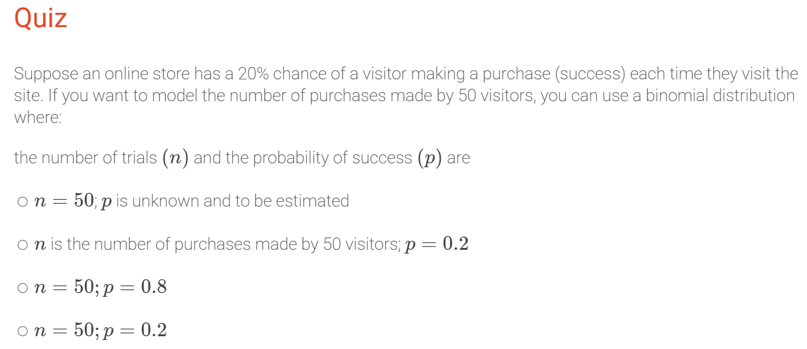
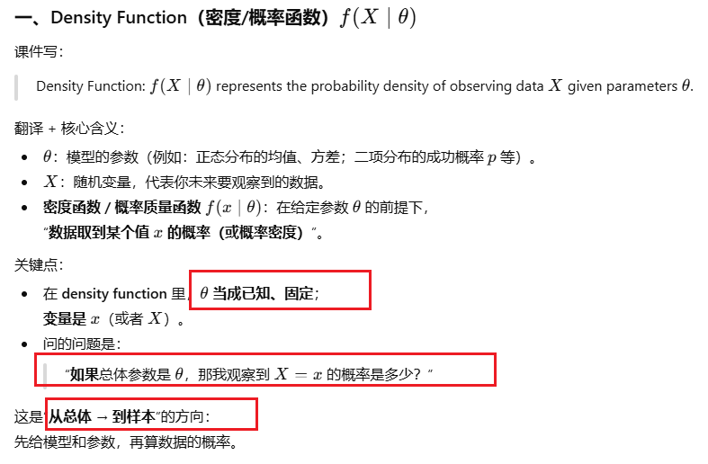
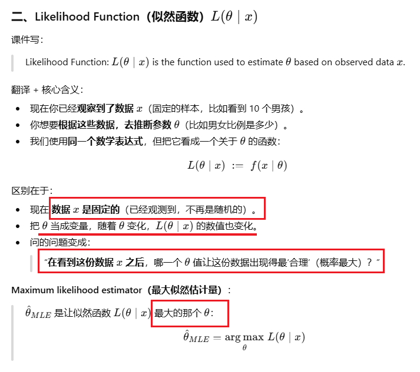
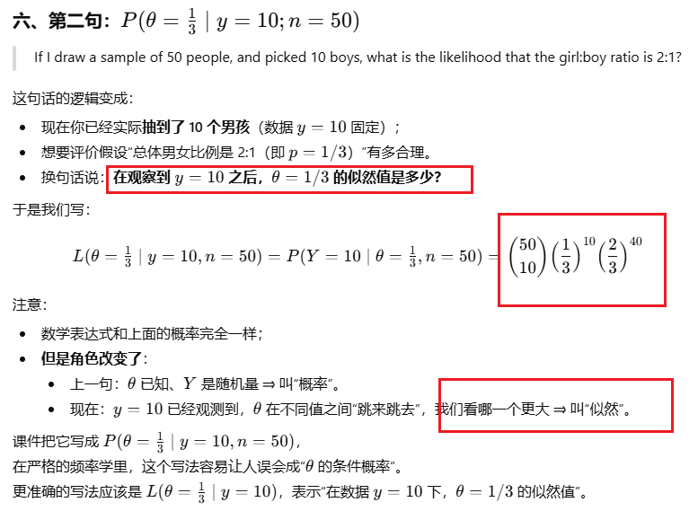
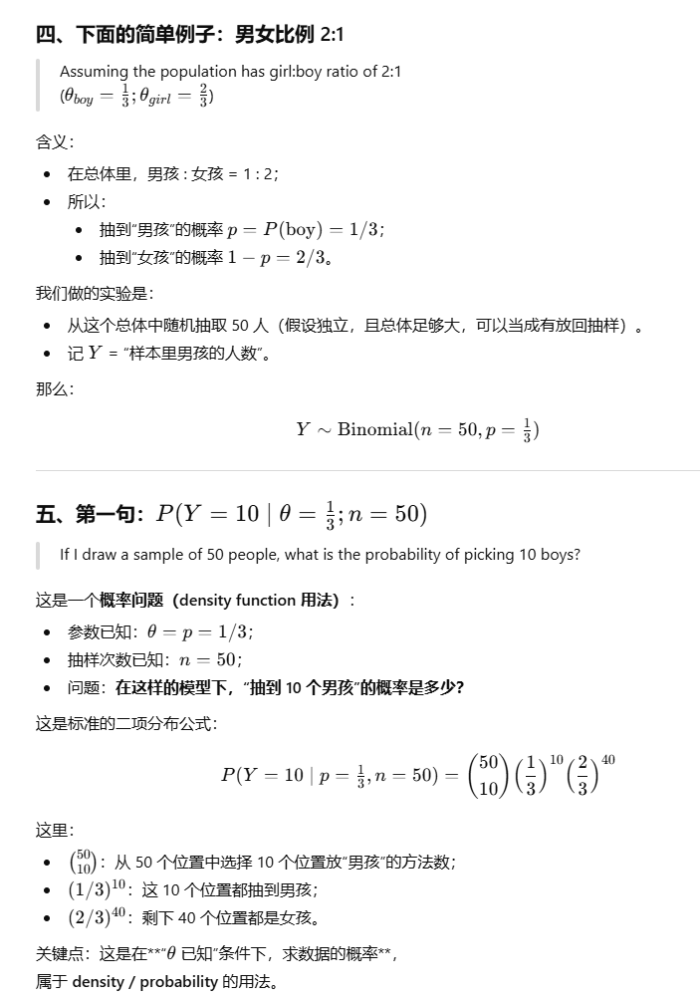
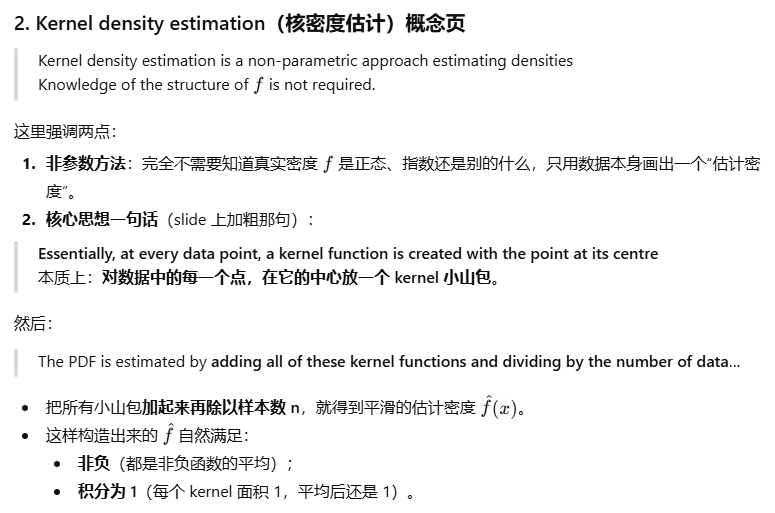
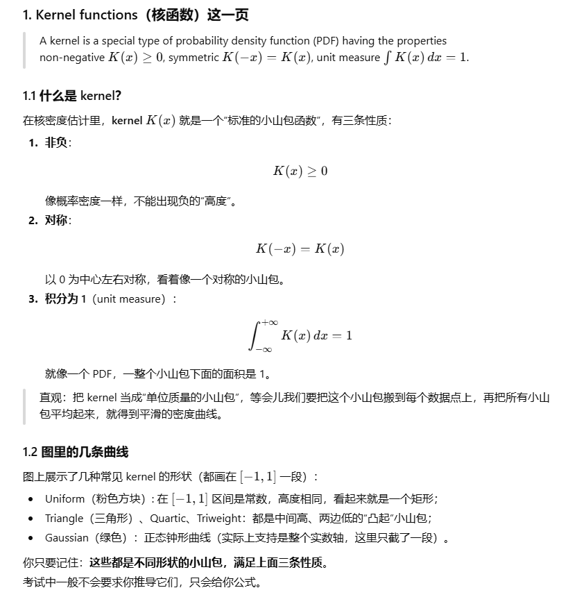
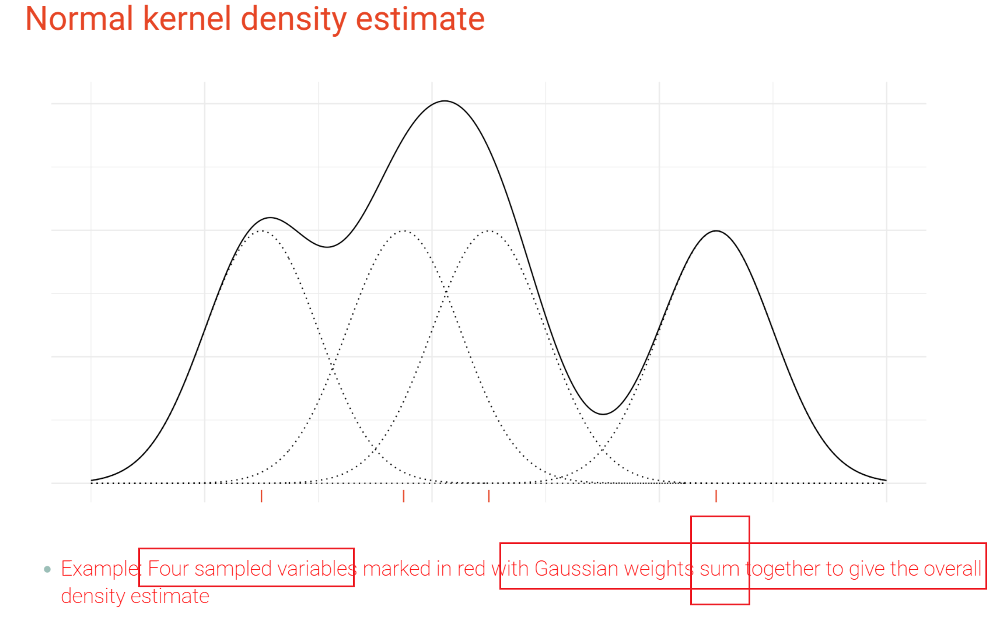
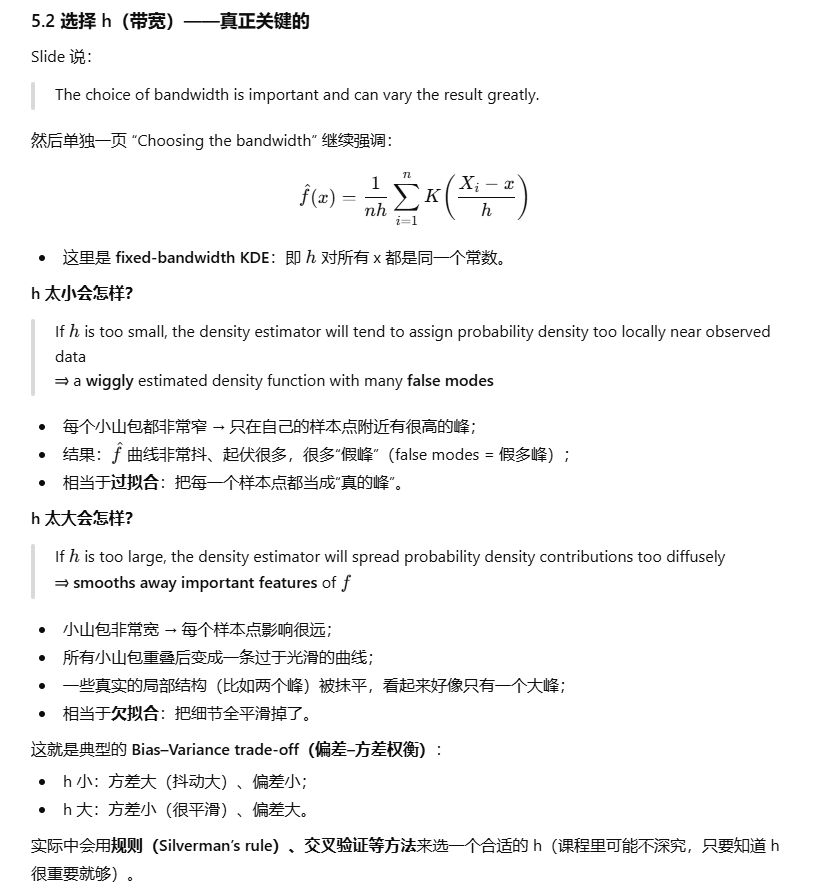
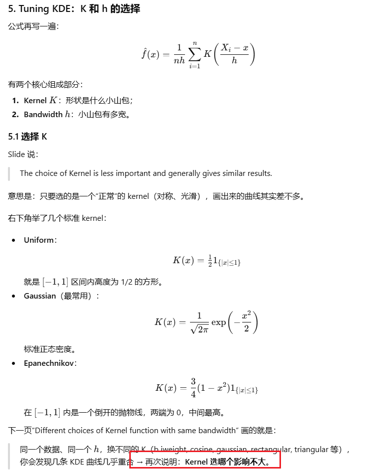

# w3： **Density Estimation**

## 1. 知识点：

### 1. 分布

> ❶ S is a discrete variable and the sample space is **(0, 60)**.

- `(0, 60)` 在数学上表示的是**连续区间**，包含所有实数：例如 0.1, 0.5, 1.7, …, 59.999 等；
- 这明显和“只能取整数 0~60”矛盾，而且还 **不包含 0 和 60**；
- 所以：**错**。

### 2. 理解n和p



> ② nnn is the number of **purchases** made by 50 visitors; p=0.2p = 0.2p=0.2

- 在二项分布中：
  - nnn 是**试验次数**（这里应该是“访客人数 50”），
  - 而“购买次数”是随机变量 SSS，不是参数 nnn。
- 把“试验次数”和“成功次数”混淆了，所以这项是错的。
- ✅ p=0.2p = 0.2p=0.2 对，❌ 把 nnn 写成“购买次数”是错误理解。

### ==3. Density estimation: the overall problem（密度估计：总体问题）和似然函数==

**Applications in EDA（探索性数据分析）**:

- See **multimodality**（多峰性）, **skewness**（偏度）, **tail behaviour**（尾部性质）.
- Support **decision making**, **classification**, and summarising **Bayesian posteriors**（贝叶斯后验）.
- Provide a compact visual summary of a distribution.





#### 1. 图里的“Population → Probability / Likelihood → Sample”

中间那张小图表达的是**两个相反方向**：

1. **Population → Sample（从整体到样本）**
   - 我们假设总体分布参数是 θ\thetaθ，
   - 用 **probability / density** 来计算“未来样本会是什么样”的概率。
   - 写法：f(x∣θ)f(x\mid\theta)f(x∣θ)
2. **Sample → Population（从样本反推整体）**
   - 我们已经看到一个样本 xxx，
   - 反过来问：哪一个 θ\thetaθ 与这份样本最“配”？
   - 这时用的是 **likelihood 函数** L(θ∣x)L(\theta\mid x)L(θ∣x)。

同一个公式，在两个方向上的角色不同：

- **概率/密度视角**：参数固定，看数据的随机性；
- **似然视角**：数据固定，看参数哪一个更“相容”。

#### 2. 举例分析





数学公式完全一样，但：

- **概率**：从“参数 → 数据”的方向；
- **似然**：从“数据 → 参数”的方向。

最大似然估计做的事就是：

> 在所有可能的 θ\thetaθ 中，找到那个让 L(θ∣y)L(\theta\mid y)L(θ∣y) 最大的 θ\thetaθ——
>  也就是“**让当前数据出现得最不奇怪**”的参数值。

### 4. 参数式密度估计 vs 非参数式密度估计

#### 一、Danger of misspecification with parametric approach

（参数式方法的“设错模型”风险）

##### 1. 什么叫 parametric density fθf_\thetafθ？

所谓 **参数式密度估计（parametric density estimation）**：

- 先大胆假设数据来自某个**具体的分布族**：
  - 比如：正态 N(μ,σ2)N(\mu,\sigma^2)N(μ,σ2)、指数、泊松、二项……
- 这个分布的形状由**有限个参数**控制：θ=(μ,σ2)\theta=(\mu,\sigma^2)θ=(μ,σ2) 等；
- 然后用样本去估计这些参数（MLE、方法矩、等等），得到 θ^\hat\thetaθ^；
- 最终密度就变成：f^(x)=f(x∣θ^)\hat f(x)=f(x\mid\hat\theta)f^(x)=f(x∣θ^)。

**关键特点：**

> 你提前“选了一个模型家族”，再在这个家族里调参数。

------

##### 2. “If the assumed fθf_\thetafθ is incorrect”

（如果你假设的 fθf_\thetafθ 是错的）

这句话说的是：
 **万一你选错了这个“家族”，后果会怎样？**

举个例子：

- 真实分布其实是“双峰的、偏斜的”；
- 但你图省事，硬说“它是正态分布”，只估一个均值加一个方差；

那就出现**模型错设（model misspecification）**：

- 无论你怎么调 μ,σ\mu,\sigmaμ,σ，这个正态分布都画不出真实的形状；
- 你得到的 f^(x)\hat f(x)f^(x) 与真正的密度差异很大。

------

##### 3. “Serious danger of inferential errors”

（会导致严重的推断错误）

一旦模型设错，下面所有基于这个模型做的推断都会出问题，比如：

- 计算某区间的概率 P(X>10)P(X>10)P(X>10) 会严重偏离真实值；
- 用这个模型做置信区间、假设检验，得到的标准误、p-value 都不可靠；
- 回归里如果误差分布假设错，也会影响 t 检验、F 检验等。

一句话：

> **参数模型的前提是“你猜的分布家族大致对”**；
>  如果这个前提错了，后面所有基于它的统计结论都可能错得离谱。

------

#### 二、Non-parametric approaches to density estimations

（非参数密度估计的大致思路）

非参数方法出现的原因就是：**我不想赌你那个具体分布猜得准**。

##### 1. “Assume little about the structure of fff”

（对 fff 的形状几乎不作假设）

非参数密度估计的哲学：

- 不再提前说“它肯定是正态/指数/泊松……”
- 只做一些非常宽松的假设，比如：
  - f(x)f(x)f(x) 是一个合法的密度（非负、积分为 1）；
  - 可能是连续的、平滑的（但不指定具体函数形式）。

所以叫 **“non-parametric”**：

> 不是说“完全没有参数”，
>  而是**不把分布限制在一个有限参数的固定家族里**。
>  真正的形状几乎都交给数据自己“画出来”。

典型例子（你后面课程会看到）：

- **直方图（histogram）**：
   把数轴分成很多小区间，数一数每个区间里有多少点 ⇒ 画出条形图；

- **核密度估计（kernel density estimation, KDE）**：
   在每个样本点附近放一个“小山包”（kernel），把所有小山包加在一起，得到一条光滑曲线：

  f^(x)=1nh∑i=1nK ⁣(x−Xih)\hat f(x)=\frac1{nh}\sum_{i=1}^n K\!\left(\frac{x-X_i}{h}\right)f^(x)=nh1i=1∑nK(hx−Xi)

  （公式不用背，现在先了解这是“靠近 xxx 的点贡献更多”的方法）

------

##### 2. “Use local information to estimate fff at a point xxx”

（在点 xxx 附近，用“局部信息”估计密度）

这是非参数方法最核心的一句：

> **要估计 f(x0)f(x_0)f(x0) 的大小，就看看“离 x0x_0x0 近的样本点”有多少。**

直观理解：

- 在数轴上选一个点 xxx：
  - 如果周围挤满了样本点 ⇒ 说明“在那里”数据很多 ⇒ 密度 f(x)f(x)f(x) 应该大；
  - 如果周围几乎没有样本点 ⇒ 说明那里很少出现 ⇒ 密度 f(x)f(x)f(x) 应该小。
- 所以我们只利用**局部 neighbourhood 的信息**来估计该点的密度，而不是强迫整体图形长成某种固定的样子（例如钟形曲线）。

这叫：

- 对比：
  - **参数方法**：用整个样本估计几个参数 μ,σ\mu,\sigmaμ,σ，再推出所有地方的 f(x)f(x)f(x) ——比较“全局”。
  - **非参数方法**：对每个 xxx 单独看它周围的数据情况 ——比较“局部”。

### 5. Kernel + KDE（核密度估计）











## 2. 代码

`dbinom()` – Binomial **density / PMF**（二项分布概率质量函数）

`dnorm()` – Normal **density / PDF**（正态分布概率密度函数）

`rnorm()` – Generate random values from Normal distribution（从正态分布生成随机数）

`hist()` – Histogram（直方图）

`density()` – Kernel density estimation（核密度估计）

`stats4::mle()` – Maximum Likelihood Estimation（极大似然估计）

1. **Linear Regression**: Use `lm` to fit linear regression models
2. **Model Predictions**: Use `predict` to make predictions based on the fitted model.

```R
pred <- predict(lm3, data.frame(Suburb = "Hawthorn", BuildingArea = 100, Car = 2))

predict(lm3, data.frame(Suburb = "Hawthorn", BuildingArea = 100, Car = 2), interval = "confidence")
```

```R
library(ggfortify)
library(broom)


melbdata_clean <- melbdata_sub |> 
    slice(-c(158,682)) #REMOVE THE WORST TWO OUTLIERS

lm1_alt <- lm(data = melbdata_clean, Price/1000 ~ BuildingArea)
lm1_alt |> tidy() #conveniently puts summary into tibble format
```

