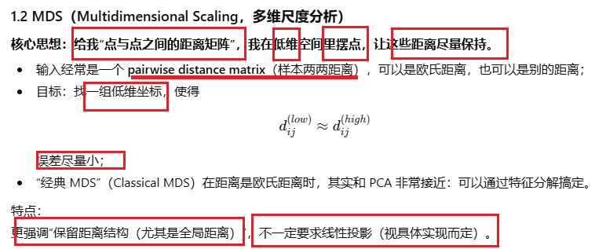
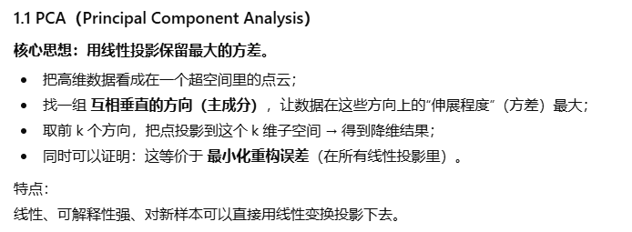
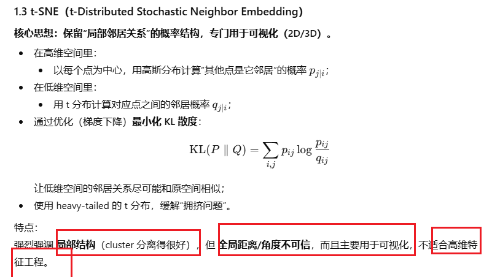
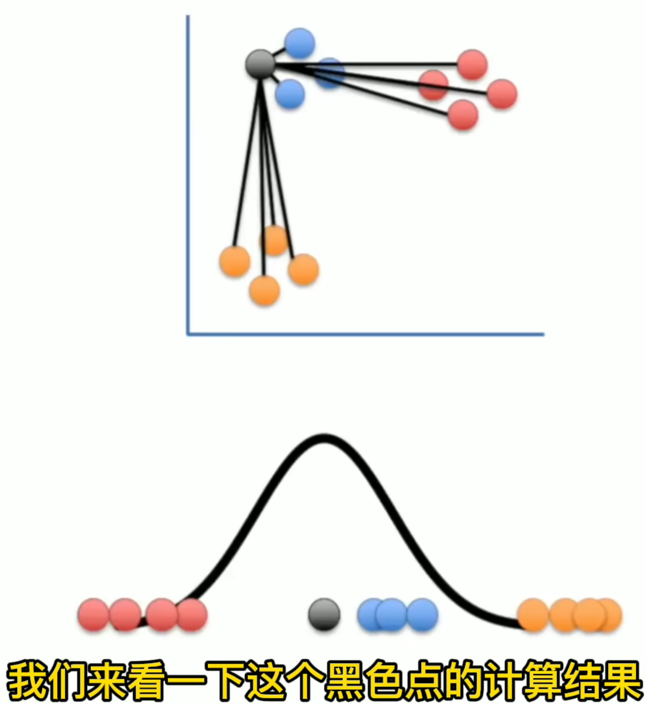
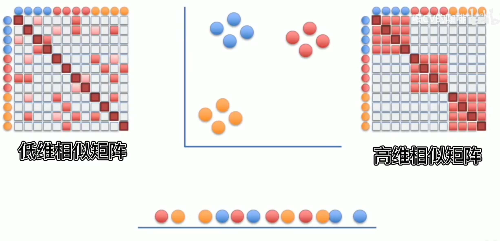

# Clustering, PCA, t-SNE, MDS

## 1. 知识点

### 1. 详细解释








| 维度                        | **PCA**                                                      | **MDS (Multidimensional Scaling)**                           | **t-SNE**                                                    |
| --------------------------- | ------------------------------------------------------------ | ------------------------------------------------------------ | ------------------------------------------------------------ |
| 中文名称                    | 主成分分析                                                   | 多维尺度分析                                                 | t 分布随机邻域嵌入                                           |
| 方法类型                    | **线性**降维                                                 | 一般视为**基于距离的**（经典 MDS 近似线性）                  | **非线性**流形学习/可视化                                    |
| 主要目标                    | 保留 **最大方差**，最小化线性重构误差                        | 保留 **样本间距离结构**（尤其全局距离）                      | 保留 **局部邻居关系**（相似点在低维仍然靠近）                |
| 优先保留的结构              | 全局方向（方差最大方向）                                     | 全局 pairwise 距离                                           | 局部 cluster / 邻域结构                                      |
| 输入需求                    | 原始特征矩阵 (X)（数值型）                                   | 样本两两距离矩阵 (D)（或原始数据再算距离）                   | 原始特征矩阵（需要计算 pairwise 相似度）                     |
| 输出是什么                  | 线性投影后的坐标 & 主成分方向向量                            | 低维坐标，尽量匹配距离矩阵                                   | 低维坐标（通常 2D/3D）                                       |
| 数学形式                    | 求协方差矩阵的 **特征分解 / SVD**                            | 定义 stress / loss，经典 MDS 也做特征分解；一般 MDS用最优化  | 用 KL 散度损失 + 梯度下降求解                                |
| 是否线性变换                | ✅ 线性：(\hat X = XW_k)                                      | 经典 MDS 可视作线性；一般 MDS 不一定                         | ❌ 非线性、非显式投影函数                                     |
| 对新样本的处理              | **非常方便**：用同一个投影矩阵 (W_k) 直接乘                  | 经典 MDS 可用线性外推；一般要重新优化或近似                  | 原始 t-SNE **没有显式映射** → 新点要重新跑或用额外模型（parametric t-SNE） |
| 保留的量                    | 最大化 low-dim 方差；等价于最小化 L2 重构误差                | 最小化距离差异：(\sum (d_{ij}^{low} - d_{ij}^{high})^2) 等   | 最小化高维/低维邻居概率分布之间 KL 散度                      |
| 对噪声的敏感度              | 对全局噪声较敏感（方差大会被当重要方向）                     | 取决于距离定义；噪声会影响距离矩阵                           | 对远距离噪声不太敏感，更关注近邻结构                         |
| 适合的维度                  | 中高维都可以；也常用于特征预处理                             | 样本太多时距离矩阵很大（(O(n^2))）会变慢                     | **样本数太大时很慢**（(O(n^2))），常在几千到几万样本以内可视化 |
| 典型用途                    | - 降维 + 后续建模（回归、聚类、分类前） - 特征压缩、去相关 - 可解释的主成分分析 | - 可视化距离结构 - 心理测量、感知实验（相似度→空间位置） - 任何只有距离矩阵没有原始特征的场景 | - 高维数据可视化（图像、词向量、embedding） - 看 cluster 分布、发现亚群体 |
| 结果的可解释性              | ✅ 好：每个主成分是原特征的线性组合，有 loadings              | 中等：坐标本身通常缺乏清晰解释，更多是相对位置               | ❌ 差：只看“点簇结构”，坐标轴没有物理含义，全局距离不可信     |
| 超参数                      | 几乎没有，只需选保留的维度 k                                 | 需要选择降维维度；有版本还要选权重/损失形式                  | 超参数较多：perplexity、学习率、迭代次数、early exaggeration 等 |
| 计算复杂度（大致）          | SVD：约 (O(nd^2)) 或 (O(n^2d))（n 样本，d 维）               | 经典 MDS约和 PCA 类似；一般 MDS 需要反复优化，取决于实现     | 通常 (O(n^2)) 甚至更高，对 n 很敏感                          |
| 全局 vs 局部                | 更偏全局结构（最大方差方向）                                 | 偏全局距离结构                                               | 强烈偏**局部结构**；全局位置/比例不可靠                      |
| 是否属于非参数密度/流形估计 | 否，本质是线性代数                                           | 否（更多是几何/距离嵌入）                                    | 属于非线性流形嵌入类方法之一                                 |
| 什么时候优先用              | - 想做“解释 + 降维 + 继续建模”- 数据大、需要高效线性方法     | - 你只有“相似度/距离矩阵”- 想保持整体距离关系                | - 主要目的是**画图看 cluster**（2D/3D 可视化）- 不在乎坐标解释，只想看群体结构 |

### 2. “什么时候用谁？”一句话策略

- **要可解释、要给后续模型用、要能方便处理新样本 → 选 PCA。**
   （例如：先 PCA 到 50 维，再喂给逻辑回归 / SVM / 聚类）
- **只有相似度/距离，没有原始特征，或者特别关心整体距离结构 → 用 MDS。**
   （比如心理学问卷里“这两种声音有多像”，只记录相似分数）
- **只想画一张好看的 2D/3D 图，看 cluster 有没有、分得是否清楚 → 用 t-SNE。**
   （如：可视化 CNN/transformer 的 embedding）

### 3. 补充解释：

1. tsne：高维度中计算任意两点相似度，让离得近的点正太分布中更高的值，相似度归一化，然后引入t分布，因为处理异常值更好； 低维度通过t分布衡量俩点之间的距离，计算出相似矩阵





​	

### 4. clustering

| 方法                                                    | 类型                      | 核心思想                                                     | 需要预先指定簇数 k？                      | 簇形状假设                                                   | 对噪声 / 离群点                                              | 主要超参数                                                   | 优点                                                         | 缺点                                                         | 典型应用场景                                                 |
| ------------------------------------------------------- | ------------------------- | ------------------------------------------------------------ | ----------------------------------------- | ------------------------------------------------------------ | ------------------------------------------------------------ | ------------------------------------------------------------ | ------------------------------------------------------------ | ------------------------------------------------------------ | ------------------------------------------------------------ |
| **K-means**                                             | 划分式 (partition-based)  | 随机初始化 k 个中心，反复执行：1）按最近中心分配样本；2）更新每簇均值为新中心；最小化簇内平方误差 (SSE) | ✅ 需要                                    | 适合“凸的、类球形”的簇；各簇方差相近、大小类似               | 对离群点很敏感（均值会被拉走）；对初始化敏感                 | k（簇数）；最大迭代次数；初始化方式                          | 实现简单、速度快；大规模数据表现好；易于理解 & 实现          | 只能发现凸簇，对非球形簇效果差；必须指定 k；对尺度敏感，需要标准化；容易陷入局部最优 | 预处理降维后的特征聚类；图像压缩(assign 像素到颜色中心)；客户分群的初步划分 |
| **层次聚类** (Hierarchical, 一般指凝聚式 Agglomerative) | 层次式 (hierarchical)     | 从“每个样本单独一簇”开始，迭代地合并最相似的两个簇；用 linkage(单链、全链、平均、Ward) 定义簇间距离；得到一棵树状图 (dendrogram) | ❌ 不一定；可以事后在树上按高度切出 k 个簇 | 不强制特定形状；linkage 不同会偏好不同结构                   | 对噪声相对敏感，但可以通过剪枝缓解；不需要初始化             | linkage 类型；距离度量；剪枝高度或目标簇数 k                 | 不需预先给 k；能给出“簇之间的层次关系”；对小数据集可视化效果好 | 复杂度较高，(O(n^2)) 起步；样本很多时不可扩展；一旦合并/切分不可回退（贪心） | 文档 / 基因等小中规模数据的层次结构分析；希望观察“哪类先合并、层级结构如何”的场景 |
| **DBSCAN**                                              | 密度式 (density-based)    | 密度可达思想：以半径 ε 邻域点数 ≥ MinPts 作为“核心点”；从核心点出发扩展密度连通区域形成簇；低密度点视为噪声 | ❌ 不需要 k                                | 能发现任意形状的簇（长条形、弯曲形都行）；只要求高密度区域被低密度区分隔 | 对噪声鲁棒：稀疏区域自然被标记为噪声；但对参数 ε、MinPts 比较敏感 | ε（邻域半径）；MinPts（最小点数）                            | 不用提前给 k；可发现任意形状簇；能自动识别噪声点             | ε 很难在维度高或密度变化大的数据上统一设置；在高维空间距离度量退化，效果变差 | 空间数据聚类（地理位置点、轨迹）；异常检测（噪声点 = outlier）；有明显“密集区域 + 稀疏背景”的数据 |
| **高斯混合模型** GMM + EM                               | 概率模型 (model-based)    | 假设数据由多个高斯分布混合而成；每个簇对应一个高斯分量；用 EM 迭代估计：E 步算后验 (P(z_k\mid x))，M 步更新均值、协方差、混合权重；软分配（每点属于各簇的概率） | ✅ 一般要给分量个数 k                      | 每个簇近似高斯椭球形；协方差可以是各向同性/对角/全协方差     | 对极端离群点敏感（会影响协方差估计）；但因为是概率模型，可以用正则化协方差缓解 | k（高斯个数）；协方差类型（full/diag）；初始化方式；正则化系数 | 能给出**软聚类**（分配概率）；比 K-means 灵活，可建“椭球簇”；有明确概率解释，可用于密度估计和生成 | 需要假设“高斯混合”，形状有限；对初始化 & 局部最优敏感；参数比 K-means 多，计算更重一些 | 声学/图像特征建模；密度估计、异常检测；需要软簇分配的场景（如用户属于多个群体的概率） |
| **谱聚类** (Spectral clustering)                        | 图论/谱方法 (graph-based) | 构造相似度图（邻接矩阵 W），计算拉普拉斯矩阵 L；取 L 的前 k 个特征向量，作为新的低维特征；再在该空间上做 K-means | ✅ 需要 k                                  | 通过图结构，可发现复杂非凸簇（取决于相似度图）               | 对噪声较敏感，取决于相似度构图方式；图太稀疏或太密都会影响效果 | 相似度函数 & 其参数（如 RBF 核宽度）；k（特征向量个数）；邻接方式（全连接、kNN 图等） | 能发现复杂形状簇；与图论联系紧密，适合图数据；常在非线性结构上优于 K-means | 需要构造 (n\times n) 相似度矩阵，(O(n^2)) 内存；特征分解成本高，不适合超大 n；对超参数较敏感 | 图数据聚类（社交网络、相似度图）；非线性流形上的聚类；与图切分（graph cut）相关任务 |

## 2. 代码w3

- `hclust` (hierarchical clustering)
- `kmeans` (K-means clustering)
- `dist` (distance matrix)
- `Rtsne::rtsne` (t-SNE)
- `cmdscale` (Multi-Dimensional Scaling)

1. Use `rnorm`, `rbinom` and `runif` to generate random samples from various probability distributions.
2. Explain and compute **MLE estimators** for different statistical models.
3. Use `density` to perform non-parametric density estimation.

## 1. 正态分布的对数似然 & 极大似然估计（MLE）

```
## 已知 sigma = 1，利用样本 x 去估计正态分布的均值 theta（μ）

# 假设你已经有一组数据：
# x <- rnorm(100, mean = 1, sd = 1)  # 这里只是示例生成数据

# 定义“负对数似然函数”
f <- function(theta) {
  # dnorm(..., log = TRUE) 直接给出 log f(x | theta)
  # sum( ) 得到样本整体的 log-likelihood
  # 前面加负号：因为 optimize 默认是找最小值，
  # 所以 -loglik 最小  <=>  loglik 最大
  -sum(dnorm(x, mean = theta, sd = 1, log = TRUE))
}

# 在一串候选 theta 上计算 log-likelihood 曲线
thetas  <- seq(0, 2, by = 0.01)          # 候选 theta 网格
loglik  <- -sapply(thetas, f)            # 记住：loglik = -f(theta)

# 看一下前几行（检查计算是否正常）
head(data.frame(thetas, loglik))

# 画出 log-likelihood 曲线
plot(thetas, loglik, type = "l",
     xlab = expression(theta),
     ylab = "log-likelihood")

# 如果真实值是 1，画一条竖线标出来（方便直观比较）
abline(v = 1, col = "red", lty = 2)

# 用 optimize 在区间 [0, 2] 上寻找使负对数似然最小的 theta
# 返回的 minimum 就是 MLE
optimize(f, interval = c(0, 2))
```

**你要记住的点：**

- `dnorm(x, mean, sd, log = TRUE)`：正态密度的对数
- `f()` 写成“负对数似然”，方便用 `optimize()` 找最小值做 MLE
- `optimize(f, interval = c(a, b))`：一维参数的 MLE 标准写法

------

## 2. 单次核密度估计（KDE）的基本用法

```
## 以区间 [0, 4] 上的均匀分布为例，演示 kernel density 的用法

set.seed(1)
x.sample <- runif(50, min = 0, max = 4)   # 从 U(0,4) 抽 50 个样本

# 使用 kernel density estimator 估计未知密度
dens <- density(x.sample,
                bw     = 0.5,            # 带宽 h
                kernel = "epanechnikov", # 核函数类型
                from   = 0,              # 估计区间起点
                to     = 4,              # 估计区间终点
                n      = 200)            # 网格点个数（越大曲线越细）

# 画出 KDE 曲线
plot(dens,
     main = "Kernel density estimate (Epanechnikov kernel)",
     xlab = "x", ylab = "Estimated density")

# 画上真实的均匀分布密度（高度 = 1/(4-0) = 0.25）
curve(dunif(x, min = 0, max = 4),
      from = 0, to = 4,
      add = TRUE, col = "red", lwd = 2)

legend("topright",
       legend = c("KDE", "True density"),
       col    = c("black", "red"),
       lty    = 1, bty = "n")
```

**关键记忆：**

- `density(x, bw = h, kernel = "...")` 是 R 默认的一维 KDE 工具
- `from`, `to`, `n` 用来控制估计区间和分辨率
- `curve(真实密度, add = TRUE)` 用来对比估计和真实分布

------

## 3. 多个带宽下的 ISE（积分平方误差）比较（Workshop 里的重头戏）

这一块是你上传文件里比较长的一段代码，用来评估不同带宽 hhh 的好坏。

```
## 目的：重复抽样 + 不同带宽 h 做 KDE，
##       计算每次的 ISE = ∫(f_hat(x) - f_true(x))^2 dx，
##       看哪类 h 表现最好。

set.seed(1)          # 保证可重复
ise.df  <- NULL      # 用来存放所有 ISE 结果
h.grid  <- seq(0.1, 1.5, by = 0.1)   # 一系列候选带宽 h

for (i in 1:9) {     # 重复 9 次抽样实验
  cat("iteration:", i, "\n")
  
  # 1. 从真正的均匀分布 U(0,4) 抽样，并排序方便后续插值
  x.sample <- sort(runif(50, min = 0, max = 4))
  
  # 真实密度，在这些 x.sample 点上的值
  true.density <- dunif(x.sample, min = 0, max = 4)
  
  # 2. 对每一个带宽 h_j 做一次 KDE
  density.estimates <- vector("list", length(h.grid))  # 存每个 h_j 的估计
  
  for (j in 1:length(h.grid)) {
    # 用 Epanechnikov 核做 KDE
    dens <- density(x.sample,
                    bw     = h.grid[j],
                    kernel = "epanechnikov",
                    n      = length(x.sample),
                    from   = 0, to = 4)
    
    # density(...) 产生的 x 网格和 y 密度值不一定刚好落在 x.sample 上，
    # 用 approx() 做一次线性插值，把密度估计映射到 x.sample 这些点上。
    density.estimates[[j]] <- approx(dens$x, dens$y,
                                     xout = x.sample)$y
  }
  
  # 3. 对每个带宽 h_j 计算一次 ISE
  ise.vec <- numeric(length(h.grid))  # 存这次实验下各 h 的 ISE
  
  for (j in 1:length(h.grid)) {
    # 近似积分：sum((f_hat - f_true)^2) * 区间长度 / 点数
    ise.vec[j] <- sum((density.estimates[[j]] - true.density)^2) *
                  (4 - 0) / length(x.sample)
  }
  
  # 4. 把这 9 次实验中的第 i 次结果整理成数据框
  temp <- data.frame(
    h      = h.grid,   # 带宽
    ise    = ise.vec,  # 对应 ISE
    sample = i         # 第几次抽样
  )
  
  # 累加到总结果中
  ise.df <- rbind(ise.df, temp)
}
```

**这里涉及几个考试常考点：**

- 如何写循环对不同 **带宽 h** 做 KDE：`for (j in 1:length(h.grid)) { density(..., bw = h.grid[j]) }`
- `approx(x, y, xout = ...)`：插值，把 KDE 的结果改写到自己想要的网格上
- ISE 的数值近似：**积分 ≈ 和 × 区间长度 / 点数**

------

## 4. 用 ggplot2 画 ISE vs 带宽（结果可视化）

Workshop 一般会用 `ggplot2` 把 `ise.df` 可视化，大致可以这样写：

```
library(ggplot2)

ggplot(ise.df, aes(x = h, y = ise, group = sample)) +
  # 每次抽样的一条 ISE 曲线
  geom_line(alpha = 0.4, colour = "grey50") +
  geom_point(alpha = 0.4, size = 1) +
  
  # 所有样本上“平均 ISE”的红色粗线（总结趋势）
  stat_summary(fun = mean, geom = "line",
               aes(group = 1),
               colour = "red", size = 1.2) +
  
  labs(x = "带宽 h",
       y = "ISE",
       title = "不同带宽的 ISE 比较") +
  theme_minimal()
```

**要记住的 ggplot 写法：**

- `ggplot(df, aes(...)) + geom_line()`：画线
- `stat_summary(fun = mean, geom = "line")`：对同一 x 取 y 的平均再画线

------

## 5. 一份简短的「Week4 R 语法小抄」

你可以打印 / 抄在纸上：

```
## 1. 对数似然 + MLE（正态，已知 sigma）
f <- function(theta) -sum(dnorm(x, mean = theta, sd = 1, log = TRUE))
optimize(f, interval = c(a, b))   # 返回 minimum = MLE

## 2. 基础 KDE
dens <- density(x, bw = h, kernel = "epanechnikov",
                from = L, to = R, n = 200)
plot(dens); curve(dtrue(x), add = TRUE, col = "red")

## 3. ISE 数值近似（在网格 x.grid 上）
ise <- sum((fhat - ftrue)^2) * (R - L) / length(x.grid)

## 4. 多个 h 下循环比较
h.grid <- seq(hmin, hmax, by = step)
for (j in 1:length(h.grid)) {
  dens <- density(x, bw = h.grid[j], ...)
  fhat <- approx(dens$x, dens$y, xout = x.grid)$y
  ise[j] <- sum((fhat - ftrue)^2) * (R - L) / length(x.grid)
}
```