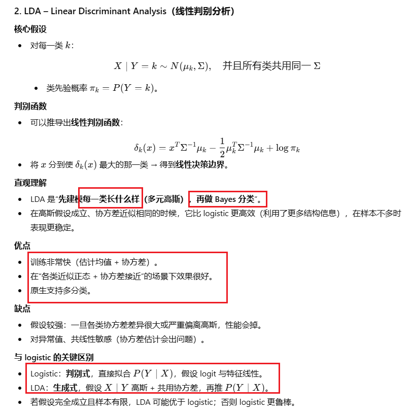
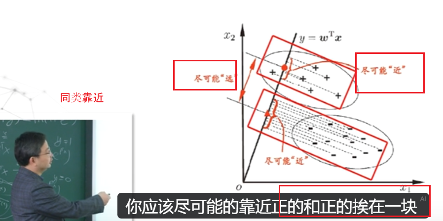
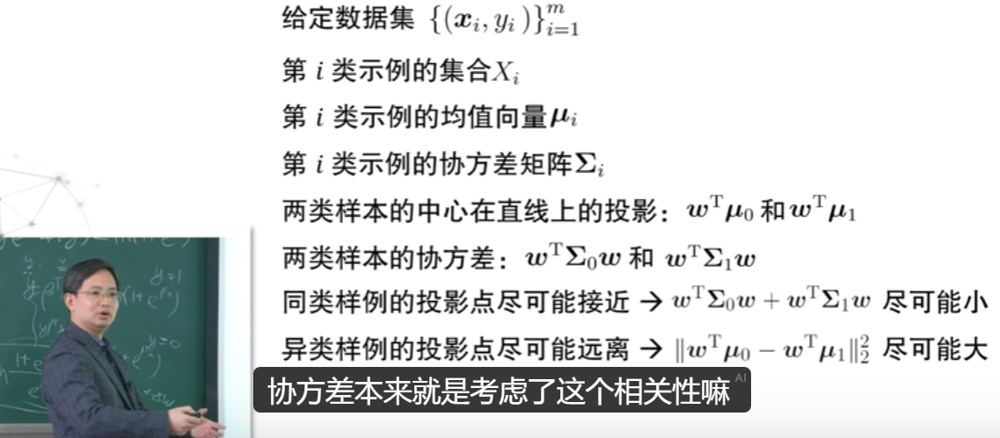
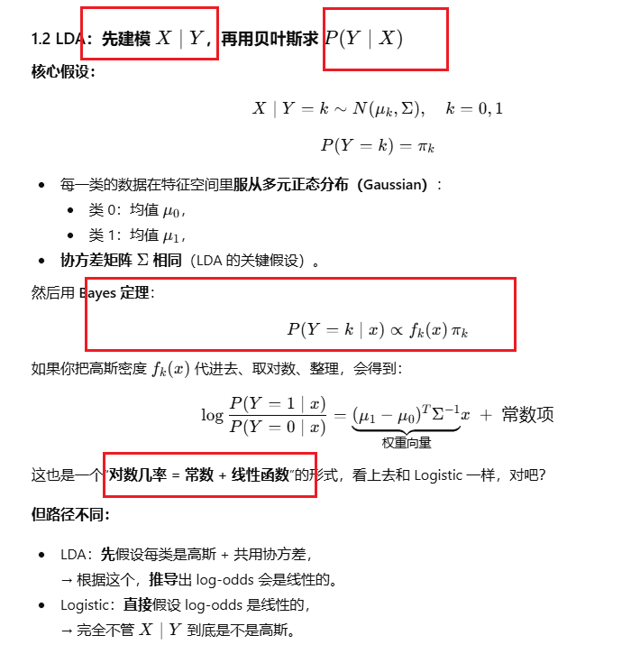
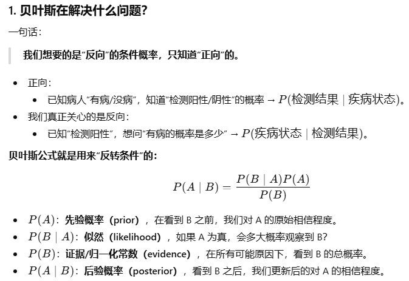

# w5 glm, lda, knn, svm

## 1. 知识点：

| Aspect                                           | glm – Logistic Regression (GLM)                              | LDA – Linear Discriminant Analysis                           | k-NN Classifier (k 近邻分类器)                               | SVM – Support Vector Machine                                 |
| ------------------------------------------------ | ------------------------------------------------------------ | ------------------------------------------------------------ | ------------------------------------------------------------ | ------------------------------------------------------------ |
| **Type / philosophy 类型**                       | **Discriminative model 判别式模型**：直接建模  (P(Y\mid X))  | **Generative model 生成式模型**：建模 (P(X\mid Y)) 再用 Bayes 规则得到 (P(Y\mid X)) | **Instance-based / lazy learning 基于实例的惰性学习**：不显式建模，只靠邻居投票 | **Margin-based classifier 基于间隔的分类器**：寻找最大间隔的决策边界 |
| **Parametric?（参数/非参数）**                   | Parametric（参数方法）: 少量参数 (\beta)                     | Parametric（参数方法）: 均值向量 + 协方差矩阵 + 类先验       | Non-parametric（非参数）: 不设固定参数维度，复杂度随数据量增长 | Parametric in form but can be very flexible with kernels（形式上参数，但核使其很灵活） |
| **What is modeled? 建模对象**                    | (\log\frac{P(Y=1\mid x)}{P(Y=0\mid x)} = \beta_0 + \beta^T x)（log-odds 线性） | (X\mid Y=k \sim N(\mu_k, \Sigma))，且所有类共用同一协方差 (\Sigma) | 不建模分布，只用距离度量（通常欧式距离）                     | 决策函数 (f(x) = w^T \phi(x) + b)，(\phi) 为特征映射（核 trick） |
| **Main distributional assumptions 主要分布假设** | 不对 (X\mid Y) 做具体分布假设，只假设 logit 与特征线性关系   | 各类条件分布均为多元正态，并且协方差矩阵相同 (\Sigma_k = \Sigma) | 只需要一个距离度量；无显式分布假设，但严重受“维度灾难”影响   | 对数据分布要求不强，更关心 margin；通常要求特征已缩放        |
| **Decision boundary 决策边界**                   | 线性（在原特征空间里是一条超平面）                           | 线性（由高斯密度 + 相同协方差推导出的线性边界）              | 一般高度非线性，随数据密度弯来弯去                           | 线性 SVM：线性边界；核 SVM：在原空间中非线性，在特征空间线性 |
| **Output 输出**                                  | 估计类概率 (P(Y=1\mid x))，可换阈值                          | 给出后验概率 (P(Y=k\mid x)) 和判别得分                       | 默认给类别；可通过邻居比例近似概率                           | 给出决策值 sign(f(x))；概率需要额外校准（如 Platt scaling）  |
| **Feature scaling 特征缩放敏感性**               | 中等：通常会做标准化更稳定                                   | 中等：协方差估计会受量纲影响，一般也标准化                   | 高：距离完全依赖尺度，必须标准化/归一化                      | 非常高：SVM 对特征尺度极其敏感，必须标准化                   |
| **Multi-class 多分类处理**                       | 原生支持（多项 logit 或一对其余）                            | 原生支持多类                                                 | 原生支持多类（邻居投票即可）                                 | 通过 one-vs-one / one-vs-rest 组合二分类器                   |







## 0. 用一句话先区分

- **Logistic regression**：

  > 直接学习“给定特征 xxx 时，属于类别 1 的概率是多少？”
  >  → 直接拟合 P(Y∣X)P(Y \mid X)P(Y∣X)，**判别式模型（discriminative）**。

- **LDA**：

  > 先学清楚“类别 0 的点长什么样，类别 1 的点长什么样”，再用贝叶斯公式来比一比哪个更像。
  >  → 先拟合 P(X∣Y)P(X \mid Y)P(X∣Y) 和 P(Y)P(Y)P(Y)，再用 Bayes 得到 P(Y∣X)P(Y\mid X)P(Y∣X)，是**生成式模型（generative）**。

两者最后都会给你一个“线性超平面”来分两类，但**走的路完全不同**。





## 2. 代码

- `e1071::svm` (Support Vector Machines)
- `stats::glm` (Logistic regression via Generalized Linear Model)
- `class::knn` (k-NN classifier)
- `MASS::LDA` (Linear Discriminant Analysis)

## 1. 加载本节会用到的 R 包

```
# 数据处理 / 整洁化
library(dplyr)       # 数据操作
library(tidyr)       # 宽表 <-> 长表、缺失值处理
library(tidyverse)   # 常用数据科学包集合（包含 ggplot2, dplyr 等）

# 画图相关
library(ggplot2)     # 画图
library(ggthemes)    # 额外主题（比如 colorblind 调色板）
library(ggpubr)      # 排版多图用

# 文件路径
library(here)        # 构造项目内相对路径

# 降维算法
library(Rtsne)       # t-SNE 算法
library(gridExtra)   # 多图布局（grid.arrange）
```

------

## 2. 读取 MovieLens 评分数据

```
# 读取 40 部电影的评分矩阵
movielens <- read.csv(here("datasets", "movielens_top40.csv"),
                      header = TRUE)

dim(movielens)   # 查看维度：行 = 用户 / 列 = 电影
```

------

## 3. MovieLens 的层次聚类（Hierarchical Clustering）

### 3.1 使用欧氏距离 + 完全链接（默认）

```
# 计算样本间的距离矩阵（默认是欧氏距离，method = "euclidean"）
d <- dist(movielens)

# 层次聚类，默认 method = "complete" 完全链接
h <- hclust(d)           # h 是一棵树（dendrogram 对象）

# 画聚类树
plot(h, cex = 0.4)       # cex 调整标签字体大小
```

### 3.2 改不同链接方法（single / complete / average）

```
h_single   <- hclust(d, method = "single")    # 最近邻（单链接），容易“串成一条链”
h_complete <- hclust(d, method = "complete")  # 最远邻（完全链接），类更紧凑
h_average  <- hclust(d, method = "average")   # 平均链接，折中

plot(h_single,   cex = 0.4)
plot(h_complete, cex = 0.4)
plot(h_average,  cex = 0.4)
```

### 3.3 用 `cutree` 按簇数切树（k = 4）

```
## 把树切成 4 个簇
movie_groups <- cutree(h, k = 4)  # 返回每部电影的“簇编号”

head(movie_groups)        # 看前几个
table(movie_groups)       # 每个簇里有多少电影
```

### 3.4 看每个簇里具体是哪些电影

```
# 按簇号把电影名字分组
split(names(movie_groups), movie_groups)

# 只看第 1 个簇里的电影
split(names(movie_groups), movie_groups)$`1`
```

### 3.5 用“高度 h” 切树，看不同 h 会产生几个簇

```
## 高度 14 时的簇数
table(cutree(h, h = 14))   # 9 个簇

## 高度 15
table(cutree(h, h = 15))   # 7 个簇

## 高度 16
table(cutree(h, h = 16))   # 恰好 4 个簇（和 k = 4 对应）

## 高度 17
table(cutree(h, h = 17))   # 只剩 3 个簇
```

在图上画出“切树高度”的水平线：

```
plot(h)
abline(h = 16, col = "red", lty = 2)  # 在高度 16 画一条虚线
```

------

## 4. 把评分转成 0/1 & 使用曼哈顿距离再聚类

这里是为了说明：如果只看“有没有评分”（0/1），而不是评分的具体数值，聚类结果会不会变化。

```
# 把 data frame 转成矩阵
movielens_mat <- as.matrix(movielens)

# NA 视为 0（没评分）
movielens_mat[is.na(movielens_mat)] <- 0

# 只关心“是否打过分”：>0 的都变成 1
movielens_mat[movielens_mat > 0] <- 1

# 用曼哈顿距离（L1 距离）计算相似度
d_man <- dist(movielens_mat, method = "manhattan")

# 再做层次聚类
h_man <- hclust(d_man)

plot(h_man, cex = 0.5)
```

切成 4 个簇，并比较簇内电影：

```
movie_groups_man <- cutree(h_man, k = 4)
table(movie_groups_man)

# 对比第 1 个簇的电影（与原始欧氏距离的结果比较）
split(names(movie_groups),     movie_groups)$`1`
split(names(movie_groups_man), movie_groups_man)$`1`
```

> 讲义结论：即使把所有评分简化为“有/无评分”，聚类结果仍然差不多，说明聚类主要由“是否看过”驱动，而不是具体打了几分。

------

## 5. MovieLens 的 k-means 聚类

```
movielens_mat <- as.matrix(movielens)
movielens_mat[is.na(movielens_mat)] <- 0   # NA 仍然先填 0

# k-means，分成 4 个簇
kmeans_res <- kmeans(movielens_mat, centers = 4)

names(kmeans_res)        # 看对象中都有哪些内容
table(kmeans_res$cluster) # 每个簇的样本数
```

------

## 6. 用 PCA + ggplot2 可视化 k-means 的聚类结果

```
library(ggthemes)  # 为了使用 colorblind 调色板

# 对电影评分矩阵做 PCA，scale = TRUE 非常重要（不同电影评分方差不同）
movie_pc <- prcomp(movielens_mat, scale = TRUE)

# 取前两个主成分作为二维坐标
movie.df <- data.frame(
  PC1    = movie_pc$x[, 1],
  PC2    = movie_pc$x[, 2],
  labels = factor(kmeans_res$cluster)  # 把 k-means 的簇号作为颜色
)

# 在 PC1-PC2 平面上画散点图，按簇号着色
ggplot(movie.df, aes(PC1, PC2, colour = labels)) +
  geom_point() +
  theme_minimal() +
  scale_colour_colorblind()   # 适合色盲的调色板
```

------

## 7. 作者–词频(author_count)数据的 PCA

```
# 读取作者-词频数据
author.dat <- read.csv(here("datasets", "author_count.csv"),
                       header = TRUE)

# 第一列是作者名，后面是每个词的计数
numeric.dat <- author.dat[, -1]      # 去掉作者名，只保留数值特征
authors     <- factor(author.dat[[1]])  # 作者名转成 factor，方便着色

# 对词频做 PCA，注意一定要 scale = TRUE
pca.scaled <- prcomp(numeric.dat, scale = TRUE)

# 取 PC1, PC2 可视化
author.df <- data.frame(
  PC1    = pca.scaled$x[, 1],
  PC2    = pca.scaled$x[, 2],
  labels = authors
)

pca.plot <- ggplot(author.df, aes(PC1, PC2, col = labels)) +
  geom_point() +
  theme_minimal()

pca.plot    # 显示 PCA 散点图
```

------

## 8. 作者数据的 t-SNE（单一 perplexity）

```
set.seed(5003)   # 固定随机种子，确保结果可复现

# 只对数值列做 t-SNE（去掉作者名那一列）
author_tsne <- Rtsne(author.dat[-1], dims = 2, perplexity = 5)$Y
# 返回的是一个 n×2 的矩阵（二维嵌入）

# 组织成 data frame 方便 ggplot
tsne_data <- data.frame(
  x      = author_tsne[, 1],
  y      = author_tsne[, 2],
  Author = authors
)

# 画二维 t-SNE 图，按作者着色
ggplot(tsne_data, aes(x = x, y = y, color = Author)) +
  geom_point() +
  labs(title = "t-SNE Visualization (Perplexity = 5)",
       x = "t-SNE 1", y = "t-SNE 2") +
  theme_minimal()
```

------

## 9. t-SNE 不同 perplexity 的对比（小循环）

```
set.seed(5003)

perplexities <- c(5, 10, 30, 50)   # 想比较的 perplexity 值
plots <- list()                    # 用来存四张图的列表

for (i in perplexities) {
  set.seed(5003)  # 每次循环都固定种子，避免随机差异

  # 运行 t-SNE
  author_tsne <- Rtsne(author.dat[,-1],
                       dims       = 2,
                       perplexity = i)$Y

  tsne_data <- data.frame(
    x      = author_tsne[, 1],
    y      = author_tsne[, 2],
    Author = authors
  )

  # 把每个 perplexity 的图存到列表中
  plots[[paste0("Perp_", i)]] <-
    ggplot(tsne_data, aes(x = x, y = y, color = Author)) +
      geom_point() +
      labs(title = paste("t-SNE Visualization (Perplexity =", i, ")"),
           x = "t-SNE 1", y = "t-SNE 2") +
      theme_minimal()
}

# 2×2 排布显示四张图
do.call(grid.arrange, c(plots, ncol = 2))
```
