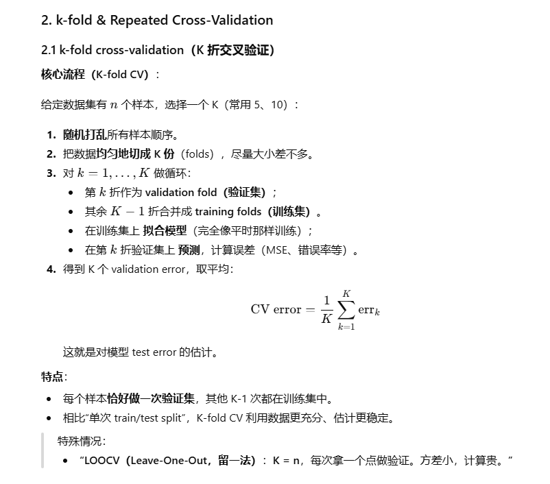
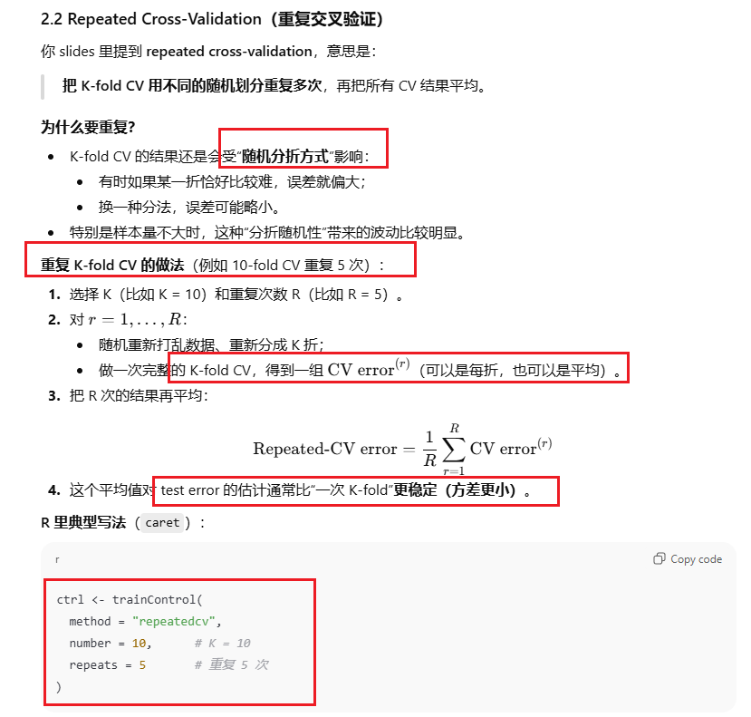

# w6: Cross Validation

## 1. 知识点

CV vs Bootstrap 对比表

k-fold & repeated cross-validation 是怎么做的、有什么用

结合你给的图，详细解释 data leakage（信息泄露）

## 1. Cross-Validation vs Bootstrap 对比表

先给你一眼就能背的对比表，然后一句话总结。

### 1.1 总结一句话

- **Cross-validation（交叉验证）**：

  > 主要用来**估计模型在新数据上的预测误差**，帮你**选模型 / 选超参数**。

- **Bootstrap（自助法）**：

  > 主要用来**估计某个统计量的抽样分布**，进而 **估计标准误、置信区间、偏差**。


| 维度                 | Cross-Validation (CV，交叉验证)                              | Bootstrap（自助法）                                          |
| -------------------- | ------------------------------------------------------------ | ------------------------------------------------------------ |
| **主要目的**         | 估计模型的 **test error / prediction error（测试误差 / 预测误差）**；用来选模型复杂度、选超参数 | 估计某个 **统计量的抽样分布（sampling distribution）**，如均值、回归系数、模型参数；用来算 **标准误（SE）**、置信区间、偏差 |
| **在意的对象**       | 一个“完整模型”（给定模型结构和超参数），想知道它在新样本上的表现 | 某个“估计量”（estimator），比如 (\hat\beta)、(\hat\mu)、(\hat f(x)) 等，它在反复抽样下的波动 |
| **重采样方式**       | 把原始数据**分成若干互不重叠的 folds（子集）**，每次留一部分作验证，剩下作训练 | 从原始样本中 **有放回地重采样（with replacement）** 得到和原样本大小相同的 bootstrap sample |
| **每轮数据角色**     | 每一轮：训练集 (train fold(s)) + 验证集 (validation fold)；**验证集的数据不参与训练** | 每一个 bootstrap 样本既用于“拟合”也用于“计算统计量”；test idea 通常是通过 bootstrap 分布本身来估 |
| **是否保留观察独立** | 一条观测在某一轮，要么在训练要么在验证（K-fold 情况下每轮只在其中一边） | 一条观测在一个 bootstrap 样本里可以出现 0 次、1 次或多次（有放回抽样） |
| **典型输出**         | - K 折平均误差（MSE、错误率、AUC…）  - 对不同模型/超参数的 CV error，用来选最优 | - 统计量的 bootstrap 分布  - Bootstrap SE、bootstrap bias、bootstrap CI |
| **常见应用**         | - 选择 polynomial degree、树深度、k-NN 的 k、SVM 的 C/γ、lasso 的 λ 等  - 比较不同模型（logistic vs random forest…) 的预测性能 | - 估计复杂统计量的标准误（如中位数、复杂回归系数）  - 置信区间构造（percentile/bootstrap-t）  - 小样本时的稳健推断 |
| **对模型的依赖**     | 很依赖“模型 + 损失函数”，重点是“这个模型预测好不好”          | 不太关心预测，而是关心“这个估计量在重复抽样下会怎么波动”     |
| **偏差/方差特点**    | 合理选择 K 时，一般是**较低偏差 + 适中方差**的 test error 估计 | 用足够多次 bootstrap 时，对 SE/CI 通常是**低偏差**，但可能有一定 Monte Carlo 方差 |
| **典型问题**         | - 如果 CV 过程设计不当（比如带信息泄露），test error 会**过于乐观**  - 重复 CV 会增加计算量 | - 过于依赖样本代表性；极端小样本时 bootstrap 分布可能不可靠  - 有些统计量（极端的 order statistics）bootstrap 不好用 |

一句话记忆：

> **CV = “我这个模型预测好不好？”**
>  **Bootstrap = “这个估计量本身有多不确定？”**





### 3. Data Leakage（信息泄露）

**他们使用的“错误 CV 流程”是**：

1. 用 **整个数据集（包括将来要当 test fold 的所有样本）**，计算每个 predictor 与 response 的相关系数。
2. 选出相关性最高的 **前 50 个变量**。
3. 用这 50 个变量作为特征，做 **k-fold cross-validation** 评估模型。

看起来每一步都很合理对吧？——但问题就出在**“用整个数据集做特征选择”**这一句。

------

### 3.2 这哪里错了？——Data Leakage（信息泄露）

slides 上写得很清楚：

> You’re using the **entire dataset**, including the **test sets**, to select features.
>  This means the **test set is influencing the training process** – even *before* the model sees it.

**翻译＋解释：**

- 交叉验证时，每一轮我们都希望：
  - **训练数据**用来拟合模型（包括任何预处理、特征选择、调参）；
  - **验证数据**完全没被训练过程“动过”，就像真正的未来新数据一样。
- 但现在你在做特征选择时：
  - 用了**整个数据集的 y（标签）和 X（特征）**去算相关性 → which variables look good?
  - 这意味着：**验证折上的信息也被用来决定选哪些特征了**。

这就叫 **data leakage / information leak（信息泄露）**：

> 验证集 / 测试集的信息，在训练阶段被“偷窥”并影响了模型或预处理步骤。

结果：

- 你在 cross-validation 中计算的“验证误差”其实不再是“真正没见过该数据的模型”的误差。
- 因为你已经用这些验证样本的 y 来帮你选了最好的特征，这对模型来说是“作弊”。
- 因此得到的 test error 会 **过于乐观（optimistic estimate）**。

slides 上也写了：

> Violates a key principle of cross-validation:
>  🔐 **The test data should be kept completely separate from training and preprocessing.**
>  Leads to an **optimistic estimate of test error**.
>  In high-dimensional settings, this can cause **severe overfitting to noise**.

特别是在高维场景（p >> n）：

- 如果你在全数据上挑“和 y 相关最高的 50 个变量”，很多相关其实是 **纯噪声**。
- 然后再做 CV，误差看起来特别漂亮，其实是“对噪声过拟合”。

------

### 3.3 正确做法：所有“用到 y 的预处理”都要放在 CV 循环里面

图里给的 Correct Approach：

1. 先把数据分成 K 折。
2. 对每一轮 kkk：
   - **只用训练折 (K-1 folds)** 做所有预处理：
     - feature selection（特征选择）
     - hyperparameter tuning（超参数调节）
     - missing data imputation（缺失值填补）等
   - 用训练折里选出的特征 / 最优超参数， 在训练折上拟合最终模型。
   - 用该模型在当前验证折上预测，计算误差。
3. 轮完 K 次，平均误差，就是没有信息泄露的 CV 误差。

Slides 第 20 页的大意就是：

> **Correct Approach**:
>
> - Split the dataset into k folds.
> - For each iteration:
>   - Perform **feature selection \*inside\* each fold**, using only the (k−1) folds (training portion).
>   - Train the model with those selected variables.
>   - Evaluate on the kkkth fold.

最后一页“Other information leakage to check” 也列出来：

- 任何这些操作都必须在 CV 循环内部做，不能用整个数据提前做：
  - **Feature selection（特征选择）**
  - **Hyperparameter optimization（超参数优化）**
  - **Missing data imputation（缺失值填补）**
     （甚至包括 scaling/standardisation，只要用了全数据的统计量也会泄露）

**一句话记忆：**

> 在 cross-validation 中：
>  **所有用到“y 或全数据统计量”的预处理，都要当成“模型的一部分”，并且在每个训练折里单独重新做一遍。**
>  验证折只能用来“看结果”，不能参与选择或拟合任何东西。

## 1. 先用一句话说清楚：**什么叫在 CV 里 data leakage？**

> **在做交叉验证估计模型性能的时候，只要“验证折/测试折”的信息被用来影响“训练过程或预处理过程”，就叫信息泄露（data leakage）**。

也就是说：

- validation / test 的作用应该是 **“考试”**；
- 但你偷偷在“复习阶段”用到了考试卷子的内容，就相当于作弊。
- 结果就是：**CV 误差会虚假偏小，看起来很厉害，实际新数据上没那么好。**

在你那张 slide 的例子里：

1. 用**整个数据集**（包含所有将来会当 validation fold 的样本）计算 “每个变量和 y 的相关系数”；
2. 挑出 top 50 特征；
3. 再做 k-fold CV。

**问题就出在第 1 步**：选这 50 个特征时，你已经看过了“所有样本的 y”，包括将来要当验证集的那部分。

- 于是验证折里的样本 **参与决定** 哪些特征被选入模型；
- 再拿同一批样本去“考察”模型性能，当然会看起来特别好 —— 因为特征就是按它们来挑出来的。

这就是典型的 **data leakage**。

------

## 2. 正确的 K-fold CV 流程到底是怎样的？

你总结得已经很接近了，我再帮你用更清晰的步骤写一遍（记成模板）：

> **正确原则：在 K 折 CV 中，每一折的“训练+预处理+调参”只能用 K–1 折的训练数据；验证折只负责“被评估”，不参与任何“选择/估计”工作。**

### 标准 K 折 CV（带预处理）的做法

假设我们要做 5-fold CV，数据集一共 n 个样本：

1. 随机把数据分成 5 折：Fold 1, 2, 3, 4, 5。
2. 对 k = 1,…,5 依次做：
   1. 把第 k 折当作 **validation fold（验证集）**；其余 4 折合并成 **training folds（训练集）**。
   2. **所有预处理、特征选择、超参数调参**，都只在这 4 折上做：
      - 例如：在这 4 折上算均值/标准差做标准化；
      - 在这 4 折上算 “变量–y 的相关性” 选 top 50；
      - 在这 4 折上调 λ、k、C 等参数。
   3. 得到“训练好的 pipeline”（预处理 + 模型）。
      - 然后 **用训练得到的参数** 去 transform 第 k 折：
        - 比如标准化：用 **训练折的均值和标准差** 对验证折做 `(x - mean_train) / sd_train`，而不是重算 mean/sd；
        - 特征选择：在训练折里选好的那 50 个特征，直接在验证折里“拿对应列”；**不能在验证折里再重新挑特征**。
   4. 在验证折上预测，算误差。
3. 5 个误差取平均 → 这一套模型结构 + 超参数的 CV 误差。

**关键点：**

- 验证折可以做“预处理”，但 **只能用训练折学来的参数来“套用”，不能用自己的数据来重新学习参数**。
- 任何“需要从数据里学参数/做选择”的步骤，都必须在训练折内部完成。

------

## 3. 那“重复 k-fold（repeated CV）”会不会又泄露？

你问：“重复的话每次 k-1 折的数据都不同有影响泄露吗？”

**不会，只要每一次重复都遵守上面的原则，就没有泄露。**

- 重复 k-fold 做的事情是：
  - 换一套新的随机折分，再做一遍“按折内部做预处理 + 训练 + 验证”的流程；
  - 目的是让 CV 结果更稳定（减小因为一次随机分折带来的运气成分）。
- **只要每一次重复中，验证折里的数据从来没有参与“特征选择/拟合/调参”，就不会泄露。**

你可以这样理解：

> 每一次 k-fold CV 都是“独立的一次考试”；我们只是让学生多考几次不同的卷子，算个平均分。
>  只要每次考试都没偷看试卷，那就不存在泄露。

------

## 4. “验证集上不能做任何预处理吗？”

这里要小心区分两件事：

1. **学习预处理参数（learn parameters）**
   - 比如：计算均值/方差、计算 PCA 的主成分、计算“变量与 y 的相关系数”并选特征、拟合缺失值填补模型、调 λ/k/C……
   - 这些操作会“用到数据本身的信息”，有时候还用到 y。
   - **这些都必须只用训练折做。**
2. **应用预处理（apply transformation）**
   - 比如：用训练折的均值/方差，对验证折做 `(x - mean_train) / sd_train`；
   - 用训练折选出的那 50 个变量，在验证折中只保留这 50 列；
   - 用训练折拟合好的 imputer，对验证折填补缺失值。
   - 这一步相当于“把同一套规则应用在新数据上” → 这是允许的，也是必要的。

所以更精确地说，不是“验证集上不能做任何预处理”，而是：

> **验证集上不能用它自己的信息来“拟合/选择”任何东西，但可以套用在训练集上学到的预处理步骤。**

------

## 5. 那最终的 test 数据集从哪里来？

理论上，**最标准的流程**是三层：

1. **Train set（训练集）**
   - 用来“学习一切”：拟合模型、调参、CV、特征选择、预处理等。
   - 我们在 train 里做 K-fold CV、重复 CV，选出“最佳模型 + 超参数 + 预处理方案”。
2. **Validation（如果和 train 分开的话）**
   - 有些书会单独留一个 validation set，用来调参，然后再在 test 上评估。
   - 在我们课程里，更多是：在 train 内部用 CV 同时完成“调参+评估”。
3. **Test set（测试集 / hold-out set）**
   - 一开始就从原始数据里**划出来**，从此以后**不参与任何训练、预处理、CV、调参**；
   - 直到最终选定了模型（已经在 train 上用 CV 做好一切）之后，**只用一次**来评估“最终模型在真正新数据上的表现”。
   - 这才是最接近“现实世界未来数据”的估计。

在很多作业/考试的设定里，如果数据不多，老师会说：

- **“我们只有 train，没有额外 test，就用 CV approximates test error。”**
- 概念上 test set 还是存在的，只是你手上没有；CV 就是在“模拟多次 train/test 切分”。

# 2. 代码

- ```
  caret::createDataPartition
  ```

  - `caret::train`
  - `caret::confusionMatrix`
  - `pROC::roc`
  - `pROC::auc`

## 1. 加载本次 Workshop 会用到的包

```
# ===== 1. 加载常用数据处理 & 可视化包 =====
library(dplyr)      # 数据处理（行列选择、过滤、分组等）
library(tidyr)      # 数据整形，宽表/长表互转
library(tidyverse)  # 一套数据科学工具集合（含 dplyr、ggplot2 等）
library(ggplot2)    # 画图
library(here)       # 管理项目内相对路径（不必写死绝对路径）

# rsample：用来把数据集切成训练集/测试集（train/test split）
# install.packages("rsample")
library(rsample)    

# ggthemes：提供色盲友好、出版风格等主题
# install.packages("ggthemes")
library(ggthemes)   
```

Workshop_week6

------

## 2. 读取数据并做初步检查（PimaIndiansDiabetes2）

数据：**PimaIndiansDiabetes2**（糖尿病二分类）

```
# ===== 2.1 加载数据集 =====
# 包含 PimaIndiansDiabetes2 数据
library(mlbench)                # 若未安装：install.packages("mlbench")
data(PimaIndiansDiabetes2)      # 把数据加载到环境中

# 查看数据维度：768 行，9 列
dim(PimaIndiansDiabetes2)

# 查看变量类型、是否有 NA
str(PimaIndiansDiabetes2)
```

Workshop_week6

> 这里的关键点：
>
> - 目标变量是 `diabetes`（因变量，因子：`"neg"` / `"pos"`）
> - 其他都是自变量（孕次、血糖 `glucose`、血压 `pressure`、体重指数 `mass` 等）

------

## 3. 处理缺失值，得到完整数据集 `complete.pimas`

```
# ===== 3. 删除含有 NA 的样本 =====
# 使用 base R 的方式
complete.pimas <- na.omit(PimaIndiansDiabetes2)  # 去掉任何包含 NA 的行

# 检查是否还有缺失
any(is.na(complete.pimas))       # TRUE/ FALSE
colSums(is.na(complete.pimas))   # 每一列 NA 的个数
```

Workshop_week6

> 这一块的逻辑：
>
> - 分类算法（logistic、LDA、kNN、SVM）一般 **不喜欢 NA**，所以先删。
> - `complete.pimas` 之后就作为干净的数据集来用。

------

## 4. 训练集 / 测试集划分（Train / Test Split）

Workshop 里既有手动 `sample()`，也有 `rsample::initial_split()` 的思路。下面是你最需要记住的两种写法：

### 4.1 手动随机划分 75% / 25%

```
# ===== 4.1 手动切分训练集、测试集 =====
set.seed(7)                              # 固定随机数种子，保证结果可复现
n  <- nrow(complete.pimas)               # 总样本数
idx <- sample(1:n, size = 0.75 * n)      # 抽 75% 作为训练集索引

pimatrain <- complete.pimas[idx, ]       # 训练集
pimatest  <- complete.pimas[-idx, ]      # 测试集

nrow(pimatrain); nrow(pimatest)          # 检查行数（大概 3/1 比例）
```

Workshop_week6

### 4.2 用 `rsample::initial_split`（更“tidyverse 风格”）

```
# ===== 4.2 使用 rsample 包划分 =====
set.seed(7)

complete.pimas.split <- initial_split(complete.pimas, prop = 0.75)
pimatrain <- training(complete.pimas.split)   # 训练集
pimatest  <- testing(complete.pimas.split)    # 测试集
```

Workshop_week6

------

## 5. 使用 caret::train 拟合不同分类器

这一部分是 **核心考试内容**：掌握如何统一接口训练不同的分类模型。

先设定通用的交叉验证控制参数：

```
# ===== 5.0 通用的交叉验证控制参数 =====
library(caret)

set.seed(5003)

tr.control <- trainControl(
  method  = "repeatedcv",  # 重复交叉验证 repeated cross-validation
  number  = 10,            # 每次 10 折
  repeats = 3              # 重复 3 次
)
```

### 5.1 Logistic Regression（广义线性模型）

```
# ===== 5.1 Logistic 回归 =====
logit.model <- train(
  diabetes ~ .,              # 用所有自变量预测 diabetes
  data      = pimatrain,
  method    = "glm",         # generalized linear model
  family    = binomial(link = "logit"),  # 指定为 logit 链接的二项模型
  trControl = tr.control
)

logit.model                     # 查看交叉验证结果（Accuracy、Kappa）
logit.model$results             # 更详细的结果表
```

Workshop_week6

> 记忆要点：
>
> - `method = "glm"` + `family = binomial("logit")` ⇒ 二分类 logistic 回归。
> - `diabetes ~ .` 表示用所有其他变量去预测 `diabetes`。

------

### 5.2 LDA（线性判别分析）

```
# ===== 5.2 LDA 线性判别分析 =====
lda.model <- train(
  diabetes ~ .,
  data      = pimatrain,
  method    = "lda",        # caret 中 LDA 的 method 名称
  trControl = tr.control
)
```

（LDA 的详细代码与上面 logistic 同样结构，只是 `method = "lda"`）Workshop_week6

------

### 5.3 kNN（k-近邻）

Workshop 里有两种情形：

- 用所有变量做 kNN
- 单独用 `mass + glucose` 两个变量做可视化

#### 5.3.1 全变量 kNN 分类器

```
# ===== 5.3.1 kNN 分类器（全特征） =====
knn.model <- train(
  diabetes ~ .,
  data      = pimatrain,
  method    = "knn",
  tuneLength = 10,           # 自动尝试 10 个不同的 k 值（k 超参数）
  trControl  = tr.control
)
```

#### 5.3.2 用两个变量做决策边界可视化

```
# ===== 5.3.2 用 mass + glucose 训练可视化用的 kNN =====
grid.knn <- expand.grid(
  glucose = seq(0, 200, length.out = 200),
  mass    = seq(0,  70, length.out = 200)
)

knn.model.viz <- train(
  diabetes ~ mass + glucose,
  data      = pimatrain,
  method    = "knn",
  prob      = TRUE,   # 让模型可以输出概率（可选）
  trControl = trainControl(method = "repeatedcv", repeats = 5)
)

grid.knn$diabetes <- predict(knn.model.viz, grid.knn)  # 预测整张网格
```

Workshop_week6

------

### 5.4 SVM（支持向量机）

同样有“全特征版本”和“只用 2 个变量可视化版本”。

#### 5.4.1 全特征 SVM（线性核 / 径向核）

```
# ===== 5.4.1 SVM 分类器（径向核示例）=====
svm.model <- train(
  diabetes ~ .,
  data      = pimatrain,
  method    = "svmRadialWeights",  # 径向基核 + 权重版本（课件中使用）
  trControl = tr.control
)
```

Workshop_week6

#### 5.4.2 仅用 mass + glucose 做决策边界可视化

```
# ===== 5.4.2 用 mass + glucose 训练可视化用 SVM =====
grid.svm <- expand.grid(
  glucose = seq(0, 200, length.out = 200),
  mass    = seq(0,  70, length.out = 200)
)

svm.model.viz <- train(
  diabetes ~ mass + glucose,
  data      = pimatrain,
  method    = "svmRadialWeights",
  trControl = trainControl(method = "repeatedcv", repeats = 5)
)

grid.svm$diabetes <- predict(svm.model.viz, grid.svm)
```

Workshop_week6

------

## 6. 用 `purrr::map` 批量训练多种模型（更高级写法）

Workshop 里还有一个“批量训练多种分类器”的写法，用 `map()` 对不同 method 做循环，非常适合考前掌握整体逻辑。

```
library(purrr)

# 先把要用的分类方法列出来
class.methods <- c("glm", "lda", "knn", "svmRadialWeights")

# 批量训练：对每个方法都训练一个模型，返回 list
models <- map(class.methods, ~ {
  if (.x == "glm") {
    # 如果是 logistic 回归，需要额外 family = binomial
    train(
      diabetes ~ .,
      data      = pimatrain,
      method    = .x,
      trControl = tr.control,
      family    = binomial(link = "logit")
    )
  } else {
    # 其他模型直接用通用接口
    train(
      diabetes ~ .,
      data      = pimatrain,
      method    = .x,
      trControl = tr.control
    )
  }
})
names(models) <- class.methods   # 给 list 里的模型起名字，方便后面取
```

Workshop_week6

> 逻辑总结：
>
> - `class.methods` 相当于一个“待训练模型列表”；
> - `map()` 就是 **for 循环的函数式写法**；
> - 对 `"glm"` 特殊处理，加上 `family = binomial()`，其他模型直接用默认参数。

------

## 7. 利用测试集评估模型（confusionMatrix 及批量比较）

### 7.1 单模型：logistic 回归在测试集上的表现

```
# ===== 7.1 Logistic 在测试集上的预测与混淆矩阵 =====
# 预测类别（因变量是因子时，caret::predict 默认输出类别 label）
logit.pred.test <- predict(logit.model, newdata = pimatest)

# 构造混淆矩阵（假设 "pos" 是阳性）
cm.logit <- confusionMatrix(
  data      = logit.pred.test,
  reference = pimatest$diabetes,
  positive  = "pos"
)

cm.logit$overall["Accuracy"]    # 准确率
cm.logit$byClass["Sensitivity"] # 灵敏度（真正率）
cm.logit$byClass["Specificity"] # 特异度（真阴率）
```

（结构和 Workshop 中对测试集的评估是一致的）Workshop_week6

------

### 7.2 批量比较多个模型的测试集表现

用 `map()` 对 `models` 里的所有模型做预测，再统一提取指标（Accuracy、Sensitivity 等）：

```
# ===== 7.2 批量计算所有模型的混淆矩阵 =====
models.cm <- map(models, ~ {
  pred <- predict(.x, newdata = pimatest)
  confusionMatrix(
    data      = pred,
    reference = pimatest$diabetes,
    positive  = "pos"
  )
})

# ===== 7.3 把整体指标整理成一张表（方便比较）=====
model.metrics <- map_dfr(
  models.cm,
  ~ tibble(
      Accuracy    = .x$overall["Accuracy"],
      Kappa       = .x$overall["Kappa"],
      Sensitivity = .x$byClass["Sensitivity"],
      Specificity = .x$byClass["Specificity"]
    ),
  .id = "Model"           # .id 会自动填入列表的名字（即模型名）
)

model.metrics   # 查看每个模型在测试集上的各项指标
```

> 这里真正要理解的是：
>
> - **思路**：先保存所有模型 → 逐个 `predict()` → 逐个 `confusionMatrix()` → 提取数值放到一张 tibble 表里。
> - **考试中**：你不一定要写成 `map`，但要看得懂这种写法。