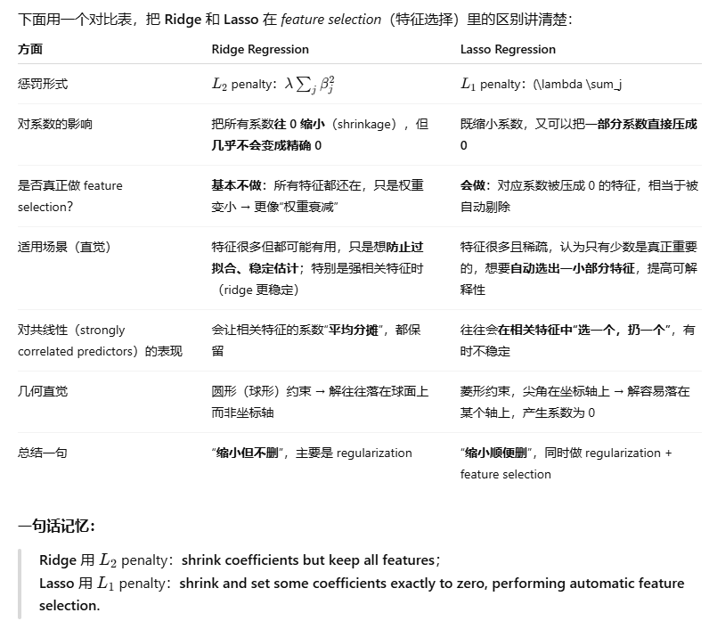

# w8:Feature Selection

## 1. 知识点




## 2. 代码

- `glmnet::glmnet` (Fix lasso and ridge regression models)
- `leaps::regsubets` (Feature selection through exhaustive searching)
- `stats::model.matrix` (Needed to interface with glmnet)

## 1. 常用包加载（本周）

```
## ========== Week 8 常用包 ==========

library(tidyverse)   # 数据处理 + 画图
library(broom)       # 整理回归结果（tidy/augment/glance）
library(mice)        # ampute() 模拟缺失、mice 多重插补
library(tidymodels)  # rsample / recipes / parsnip 等统称
library(themis)      # step_smote()，处理类别不平衡
library(discrim)     # 判别分析模型（比如 LDA/QDA）
theme_set(theme_minimal())  # 全局简洁主题
```

------

## 2. Skin-cancer 简单线性回归 + 完整数据基准（No Missing）

> 目标：用一个很简单的例子，先在“无缺失”的情况下做线性回归，然后再对比“有缺失”的结果。Workshop_week8

```
## ========== 2.1 读取皮肤癌数据 skin-cancer.csv ==========

skin_cancer <- read_csv("skin-cancer.csv")
# 常见变量：Mort(死亡率), Lat(纬度), Lon, Pop, Income 等
glimpse(skin_cancer)

## ========== 2.2 完整数据上的简单线性回归 ==========
## 模型：Mortality ~ Latitude

lm_full <- lm(Mort ~ Lat, data = skin_cancer)

# 回归系数表（估计值、标准误、t 值、p 值等）
tidy(lm_full)

# 每个观测对应的拟合值、残差等
augment(lm_full)

# 模型整体指标（R^2, 调整 R^2, F统计量等）
glance(lm_full)

# 画出回归直线 + 数据点（方便直观对比）
ggplot(skin_cancer, aes(x = Lat, y = Mort)) +
  geom_point() +
  geom_smooth(method = "lm", se = TRUE)
```

> 要点记忆：
>
> - `lm(Mort ~ Lat, data = ...)`：最简单的一元线性回归。
> - `tidy()` / `augment()` / `glance()` 是 broom 的三板斧，用来整理输出。

------

## 3. 用 `mice::ampute()` 人为制造缺失（MCAR）

> 目的：人为在自变量里“打洞”，模拟缺失数据，看看**直接丢掉缺失行**对回归结果的影响。

```
## ========== 3.1 用 ampute() 制造缺失（MCAR） ==========

set.seed(5003)

# 只保留关心的变量，这里举例 Mort 和 Lat
sc_small <- skin_cancer %>%
  select(Mort, Lat)

# ampute()：按给定比例随机制造缺失（MCAR）
amp_res <- ampute(
  data = sc_small,
  prop = 0.3,       # 30% 的观测会被打上 NA
  mech = "MCAR"     # 缺失机制：完全随机 Missing Completely At Random
)

sc_miss <- amp_res$amp  # 含有缺失值的新数据集

# 看看缺失情况
colSums(is.na(sc_miss))
```

### 3.2 在“含缺失数据”上直接跑回归（Listwise Deletion）

```
## ========== 3.2 含缺失数据时，直接 lm() 的行为 ==========

lm_miss <- lm(Mort ~ Lat, data = sc_miss)  # 默认会自动删掉含 NA 的行

tidy(lm_miss)
glance(lm_miss)

nrow(sc_small)   # 原始样本量
nobs(lm_miss)    # 实际用于回归的样本量（缺失行被删掉）
```

> 要点记忆：
>
> - **默认 lm 遇到 NA 就是 listwise deletion（整行丢弃）**；
> - 缺失越多，有效样本越少 → 估计方差变大，结果不稳定；
> - 如果缺失不是随机的，还可能**产生偏倚（bias）**。

------

## 4. “线性回归 + 噪声”的随机插补（Random Imputation Using Linear Regression + Noise）

> 核心思想：
>
> - 利用数据中已观测到的关系，先拟合“缺失变量 ~ 其他变量”的线性回归；
> - 对缺失位置用预测值 + 随机噪声做插补；
> - 这样既利用了线性关系，又保留了一定的随机性（避免所有插补值都在回归线上，低估方差）。Workshop_week8

这里举例：假设 **Lat 有缺失**，我们用 Mort 来回归 Lat，然后给 Lat 做插补。

```
## ========== 4.1 拟合“Lat ~ Mort”的回归模型（只用完整行） ==========

# 只在 Lat 非缺失的行上拟合
fit_lat <- lm(Lat ~ Mort, data = sc_miss, na.action = na.omit)

summary(fit_lat)$coefficients  # 查看回归系数
sigma_hat <- summary(fit_lat)$sigma  # 残差标准差：作为噪声强度

## ========== 4.2 对 Lat 的缺失值做“回归 + 噪声”插补 ==========

sc_imp <- sc_miss   # 复制一份数据

# 找出 Lat 为 NA 的行号
idx_na <- which(is.na(sc_imp$Lat))

# 预测这些行 Lat 的回归拟合值
mu_hat <- predict(fit_lat, newdata = sc_imp[idx_na, ])

set.seed(5003)
# 在预测值附近，加上 N(0, sigma_hat^2) 的随机噪声
sc_imp$Lat[idx_na] <- mu_hat + rnorm(
  n    = length(idx_na),
  mean = 0,
  sd   = sigma_hat
)

# 检查：现在 Lat 已经没有 NA 了
colSums(is.na(sc_imp))
```

### 4.3 用插补后的数据再次做 Mort ~ Lat 回归

```
## ========== 4.3 用插补后的数据做回归，和 lm_full / lm_miss 对比 ==========

lm_imp <- lm(Mort ~ Lat, data = sc_imp)

tidy(lm_full)$estimate   # 完整数据的系数
tidy(lm_miss)$estimate   # 直接删 NA 的系数
tidy(lm_imp)$estimate    # 插补后的系数

# 可视化对比三条回归线
bind_rows(
  augment(lm_full) %>% mutate(model = "Full data"),
  augment(lm_miss) %>% mutate(model = "Listwise deletion"),
  augment(lm_imp)  %>% mutate(model = "Regression + noise imputation")
) %>%
  ggplot(aes(x = Lat, y = Mort, colour = model)) +
  geom_point(alpha = 0.4) +
  geom_smooth(method = "lm", se = FALSE)
```

> 记住这套“随机插补 + 回归”的步骤和意义：
>
> 1. 用完整行拟合缺失变量的回归模型。
> 2. 对缺失位置用预测值 + 高斯噪声插补。
> 3. 再用插补数据跑目标模型（这里是 Mort ~ Lat），比较估计的稳定性。

------

## 5. 处理类别不平衡：SMOTE（Synthetic Minority Over-sampling Technique）

> 这一部分是用 **tidymodels + themis** 演示：
>
> - 类别极度不平衡 ⇒ 模型倾向于只预测多数类；
> - 使用 **`step_smote()`** 在配方（recipe）中对少数类做合成过采样，从而平衡类别。Workshop_week8

这里用一个二分类例子（Workshop 里可能是某个医疗/信用数据集，你记框架就行）：

### 5.1 准备数据 + 划分训练/测试

```
## ========== 5.1 构造一个有类别不平衡的二分类数据集 ==========

# 假设 data2 是一个二分类数据框，响应变量是 Class
# Class 有 "pos"（少数类）和 "neg"（多数类）
data2 <- read_csv("some_imbalanced_data.csv")  # 示例

data2 <- data2 %>%
  mutate(Class = factor(Class))  # 确保是因子

# 训练/测试划分（按 Class 分层，保证比例）
set.seed(5003)
data_split <- initial_split(data2, strata = Class, prop = 0.8)
train_data <- training(data_split)
test_data  <- testing(data_split)

# 看一下训练集的类别分布（一般会严重偏斜）
train_data %>% count(Class)
```

### 5.2 构建 recipe：**先 SMOTE，再标准化**

```
## ========== 5.2 使用 recipe + step_smote() 处理不平衡 ==========

rec_smote <- recipe(Class ~ ., data = train_data) %>%
  step_smote(Class) %>%           # 关键一步：对少数类做 SMOTE 合成样本
  step_normalize(all_predictors())  # 对所有自变量标准化（可选）

# 看看 SMOTE 后的类别分布（在“流汁”后的数据里看）
prep(rec_smote) %>%
  juice() %>%
  count(Class)
```

> 记忆点：
>
> - `step_smote(响应变量名)` 必须放在 recipe 里，且要在 `prep()` 之后才实际生效；
> - `juice()` 是从预处理后的训练数据中提取数据，看效果。

### 5.3 选择分类模型（例如 LDA 或 SVM）

```
## ========== 5.3 指定模型：比如 LDA ==========

lda_spec <- discrim_linear() %>%
  set_mode("classification") %>%
  set_engine("MASS")   # 背后用 MASS::lda

## 或者：SVM（径向核）示例
svm_spec <- svm_rbf(cost = 1, rbf_sigma = 0.1) %>%
  set_mode("classification") %>%
  set_engine("kernlab")
```

### 5.4 workflow 组合 + 交叉验证评估

```
## ========== 5.4 用 workflow 组合配方和模型 ==========

wf_lda <- workflow() %>%
  add_model(lda_spec) %>%
  add_recipe(rec_smote)

# 5-fold 交叉验证（按 Class 分层）
set.seed(5003)
folds <- vfold_cv(train_data, v = 5, strata = Class)

# 用 fit_resamples() 在 CV 上评估模型
lda_res <- fit_resamples(
  wf_lda,
  resamples = folds,
  metrics   = metric_set(accuracy, roc_auc, sens, spec)
)

collect_metrics(lda_res)
```

### 5.5 在测试集上训练 + 评估（看 SMOTE 的效果）

```
## ========== 5.5 最终在训练集上拟合 + 在测试集上评估 ==========

lda_fit <- fit(wf_lda, data = train_data)

test_pred <- predict(lda_fit, new_data = test_data, type = "prob") %>%
  bind_cols(predict(lda_fit, new_data = test_data)) %>%   # .pred_class
  bind_cols(test_data %>% select(Class))                  # 真值

# 混淆矩阵
test_pred %>%
  conf_mat(truth = Class, estimate = .pred_class)

# 主要指标：Accuracy / Sensitivity(对少数类) / Specificity(对多数类) / ROC AUC
test_pred %>%
  roc_auc(truth = Class, .pred_pos)
```

> 要点记忆：
>
> - SMOTE 是在 **训练集** 上做数据增强，**绝不能在测试集上做**。
> - 对不平衡问题，只看 Accuracy 很容易被“多数类预测正确”骗了，一定要看：
>   - Sensitivity（少数类真正率）
>   - Specificity（多数类真正率）
>   - ROC AUC